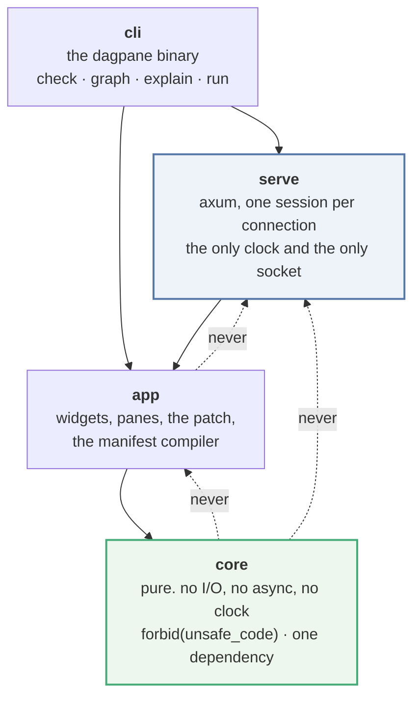

# Architecture

Why the parts are shaped the way they are. The API docs say what each function does; this
says which decisions are load-bearing and what breaks if you change them.

Every count in this document came from `dagpane explain` on `examples/sales.toml`, and the
app it was measured on is named beside it. A count without an app attached does not mean
anything.

---

## 1. The asymmetry everything follows from

> **A cell that recomputes when it did not need to costs a user some milliseconds. A cell
> that does not recompute when it should have costs them a wrong number, on a page that
> looks exactly like a working one.**

Those two are not symmetric, and the difference decides every fallback in this design. The
consequences each show up as a mechanism below.

| consequence | mechanism |
|---|---|
| a missed invalidation must be structurally hard, not merely tested for | a cell reuses only when the digests of its inputs match the ones it recorded *when it last ran* (§3) |
| a cell that never ran can never look fresh | validity is a separate bit from staleness; an empty `input_digests` cannot match anything (§3) |
| an over-declared edge must cost work, never correctness | declared edges, plus a digest short-circuit that stops the pass at that cell's boundary (§3, ADR-0001) |
| a cell must never see a mixture of old and new inputs | ascending-height evaluation, decided once at build time (§3, ADR-0002) |
| the claim must be checkable by someone who does not trust us | every pass returns a `Trace`; `dagpane explain` prints it; the wire carries it (§7) |
| the engine must be testable without a browser, a socket or a clock | `dagpane-core` has no I/O and no clock, and CI greps for it (§2) |
| a claim about *counts* must be checked against a full recompute | a differential oracle over 200 random graphs (§8) |

## 2. Crate boundaries follow the arrow

The product is one arrow — *an input changes → a graph decides what is stale → only those
cells recompute → a patch goes out, not a page* — and each segment is a crate.



The dotted edges are the ones CI enforces with a grep, and each of them is load-bearing:

* **`core` never depends on an async runtime, a socket or a clock.** `cargo test -p
  dagpane-core` is a complete test of the reactive semantics on a machine with no browser
  and no network, and a trace taken under a test harness is byte-identical to one taken in
  production. An engine that needs a runtime to be tested is an engine nobody tests.
* **`app` never depends on a server.** The whole patch protocol — what is sent, and what is
  deliberately not sent — is exercised by `cargo test -p dagpane-app` with no process
  listening on anything.
* **Nothing depends on an HTTP client.** A data-app runtime that can phone home is not one
  anybody self-hosts, and the promise is only as good as the dependency tree.

`serve` is the smallest crate here on purpose. It owns the three things that cannot exist
without a machine — an address, a clock and a browser — and nothing else.

## 3. The pass

One interaction is one pass, and a pass is five steps.

```
commit():
  1. epoch += 1
  2. for each staged (input, value):
        digest it; if it equals what the slot already holds, drop it —
        this input did not change and is not a root.
        otherwise write it, stamp changed_at = epoch, and record it as a root.
  3. if no roots: return an empty trace. nothing ran, and nothing is sent.
  4. plan = every cell reachable from the roots over the reverse edges,
            sorted by (height, id).                       <- the closure
  5. for cell in plan, in that order:
        a source: it was written in step 2; record it and move on.
        current = the digests of this cell's inputs, right now.
        if the cell is valid AND current == the digests it recorded last time it ran:
              REUSED — its cache stands, its compute does not run.
        else if any input is in error:
              FAILED — the compute is not called; the error names the originating cell.
        else:
              run the compute.
              digest the result. changed = (digest != the one it held).
              if changed, stamp changed_at = epoch.
              record input_digests = current.
```

Three things about that loop are worth stating explicitly, because each of them is a bug
somebody could reintroduce while making it faster.

**Step 4 sorts, and the sort is the glitch-freedom guarantee.** `height` is the longest path
from any source, computed once by Kahn's algorithm when the graph was built. Every edge runs
from a lower height to a strictly higher one, so by the time a cell is evaluated all of its
inputs have reached their final value for this pass. There is no re-entrancy, no second
pass, and no "iterate until stable" loop. Sorting by insertion order instead would be a
one-line change that compiles, passes most of the suite, and makes a diamond join observe one
new parent and one old one. `a_diamond_join_never_sees_a_mixed_state` is what stands between
those two.

**Step 5's reuse test compares against the digests recorded when the cell last ran, not
against a global revision counter.** The revision-counter formulation — "green if no
dependency changed since revision N" — needs an extra guard for a cell that was skipped at an
earlier revision, and forgetting the guard is a silent-staleness bug. Recorded input digests
need no such guard: a cell that has never run recorded nothing, so nothing can match, so it
runs.

**The closure is structural, and the reuse test is not.** A pass *visits* every cell
downstream of the roots — that is a digest comparison per input, and it is what `visited`
counts. It *evaluates* far fewer. On the bundled example, moving the slider visits 8 of 11
cells, evaluates 6, and 4 of those produce a new value. The distinction is reported rather
than smoothed over, because folding `visited` into `evaluated` would make the numbers better
and the document worse.

### What a pass costs the app that did not change

The last two lines of the table are the point:

| interaction on `examples/sales.toml` (11 cells, 7 panes) | visited | evaluated | reused | changed | untouched | panes sent |
|---|---|---|---|---|---|---|
| first render | 8 | 8 | 0 | 8 | 3 | 7 |
| `min_amount = 400` | 8 | 6 | 1 | 4 | 3 | 3 |
| `region = north` | 8 | 6 | 1 | 5 | 3 | 4 |
| `region = all` (already `all`) | 0 | 0 | 0 | 0 | 11 | 0 |

The first render's three "untouched" cells are the source and the two controls: a source is
not evaluated, it is *held*, and a pass only records one when that pass is what changed it.

## 4. The digest, and what a collision would cost

Values are compared by a 128-bit FNV-1a content digest, taken **once, when the value is
produced**, and stored beside it. Comparison is then two `u64`s whether the value is a
boolean or a table of a million rows, and the hashing cost is one pass over data the cell
just built anyway.

It is written in-tree, in about forty lines, for two reasons. `std::hash::Hasher` is 64-bit
and `DefaultHasher` is explicitly not stable across Rust releases, so a digest written down
by `dagpane explain` would stop meaning anything when the toolchain moved. And this is the
one place in the project where a bug is *silent*: a colliding digest shows a user a stale
number and the page looks fine. Forty lines a reviewer can read in full are worth more here
than a faster function they will not.

Floats are canonicalised before hashing — every NaN hashes as one NaN, and `-0.0` hashes as
`0.0` — because the engine's contract is "an equal value does not propagate" and IEEE
equality disagrees with bitwise equality at exactly those two points. A user shown `0` twice
has not been shown a change.

**The honest position on collisions.** A chance collision sits at roughly 2⁻¹²⁸ per
comparison and is not a risk this project manages. An *adversarially chosen* collision
against FNV is achievable by anyone who can choose a cell's exact output bytes; dagpane's
threat model does not include an attacker who controls a cell's output and wants the page to
show a stale figure. If that ever becomes a real threat, `crates/core/src/digest.rs` is the
one file that changes. See `SECURITY.md` and ADR-0003.

## 5. Panes are not cells, and the patch is computed from views

A pane is a *view of* a cell. Two panes can show one cell; a cell can drive no pane; and a
cell whose value changed can leave its pane's view identical — a table pane sends its first
fifty rows, and a change in row nine thousand changes the cell and not the page.

So the patch is built in two stages. The trace says which **cells** changed; each pane
showing one of those is re-rendered; and only a pane whose **rendered view** differs from the
one that viewer already has goes on the wire. Skipping the second stage would send that table
pane anyway, and would quietly make the engine's numbers look better than the bytes.

On the bundled example this is visible: a `$25` floor changes `filtered`, and the
`top_orders` pane — the ten largest orders — is not repainted, because a `$25` floor does not
remove any of them.

## 6. The dataframe seam

`Table` is a plain columnar container: `Vec<Option<T>>` per column, four column types, no
chunking, no dictionary encoding, no SIMD. Sixteen bytes for an `i64`. It is not Arrow and
the README says so.

It exists because taking a real dataframe dependency in v0.1.0 would have decided two other
questions by accident. It would have decided the WASM question — Polars does not build for
`wasm32-unknown-unknown` — and it would have implied a query capability the rest of the code
does not have. What is here is honest about its size: it is fine for the
hundreds-of-thousands-of-rows apps this runtime targets, and it is the wrong tool above that.

**Where a real engine plugs in**, concretely, so that this is a plan and not a gesture:

1. `Value::Table(Table)` becomes `Value::Frame(Arc<dyn Frame>)`, where `Frame` requires
   `rows()`, `schema()`, `head(n) -> Table` and `digest() -> Digest`. Only the last of those
   is interesting: the engine's entire contract with a value is *produce it, digest it,
   compare the digest*, so an engine that can content-hash a batch cheaply plugs in without
   touching `session.rs` at all.
2. `crates/core/src/transform.rs` becomes one implementation of a `Transform` trait rather
   than the only one, and `manifest.rs`'s `StepOp` compiles against the trait.
3. `crates/app/src/view.rs` already renders through `Table` alone (`head`, `schema`, `row`),
   so the render path needs `Frame::head` and nothing else.

There is deliberately **no such trait in the tree today**. A trait with one implementation
and no second caller is speculative generality that costs a crate and constrains the design
before anything has pushed on it. This section is the seam; the code is not.

## 7. The wire contract, and why it is renderer-blind

The server sends `View` values — `metric`, `table`, `bar`, `line`, `text`, `error` — not
HTML. The bundled client turns them into DOM nodes; anything else could turn them into
something else. Two consequences follow, and both were the reason:

* A different front end is **additive**. It reads the same `init` and the same `patch`, and
  it does not require a change to `app` or `core`.
* The patch stays measurable. If the server sent markup, "three panes of seven" would be a
  statement about a string, and nobody could check it.

Every `patch` carries a `stats` block — the same numbers `explain` prints. That is not
telemetry and it never leaves the connection; it is there so the claim is visible in a
browser's network tab without a special build.

The client is one file with inline CSS and JavaScript, no package manager and nothing fetched
at run time. A test asserts that the only URL in it is the SVG namespace. That matters twice:
the first five minutes of using this project do not involve `npm install`, and an app served
on an air-gapped host renders.

## 8. What is checked, and what is not

**Checked.** 122 tests. `crates/core/tests/oracle.rs` is the one that decides whether the
rest mean anything: 200 pseudo-random graphs from a seeded in-tree LCG, 12 interactions each,
and after every one of the 2,400 commits both a correctness assertion against a full-recompute
oracle and an economy assertion that the pass stayed inside the structural closure. A count
assertion on a hand-drawn graph cannot catch a scheduler that skips too much; this can, and
did — see ADR-0003's last consequence.

Also checked, because each is a property somebody could break while optimising: two sessions
over one `Arc<Graph>` share one allocation per untouched source (`Arc::ptr_eq`, not an RSS
measurement, which is flaky on every CI runner); an input set to the value it already holds
produces an empty pass; a repeated identical failure does not re-wake the page; recovery
clears a poisoned subtree in one pass; and `visited == set + evaluated + reused + failed`
holds inside `commit` itself as a `debug_assert`, so every test in the suite checks it for
free.

**Not checked, and therefore not claimed.** There is no benchmark in this repository. No
number anywhere in these documents is measured in seconds, and no claim is made about
apps-per-core, memory under N viewers, or latency against any other runtime. `ROADMAP.md`
records that the concurrency measurement has to come *before* any performance sentence does,
not after.
