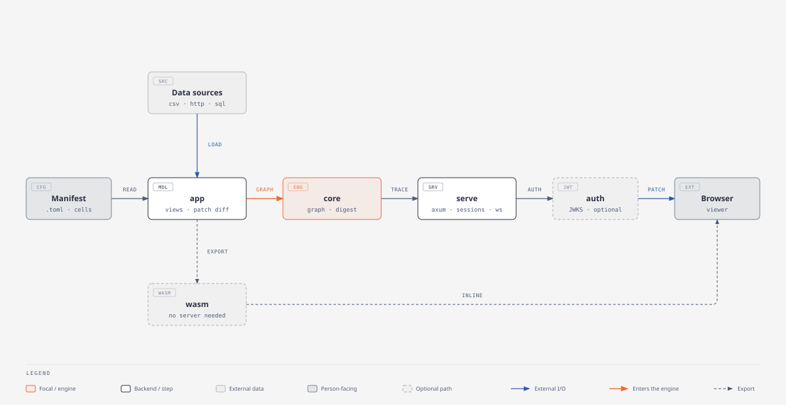
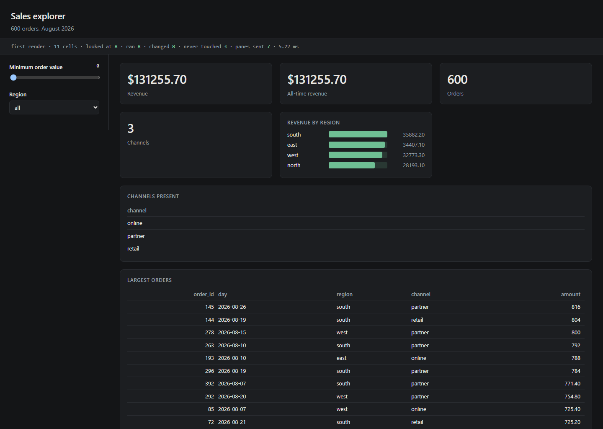
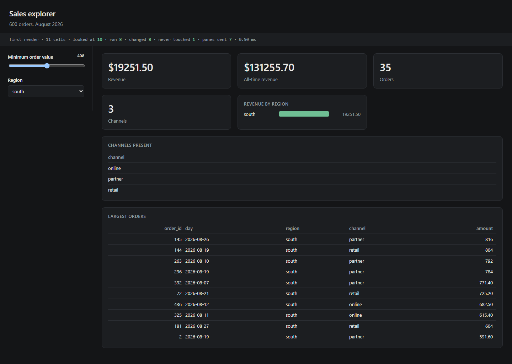

# dagpane

**An interaction recomputes the cells that depend on it, and nothing else — and the runtime
prints which ones, so you can check.**

A data app is a dependency graph whether or not its runtime treats it as one. dagpane
treats it as one: cells declare what they read, a change marks only what is downstream of
it, and a cell whose inputs still hold the same values serves the value it already
computed. What that saves is not an estimate — every pass returns a record of itself, and
`dagpane explain` prints it.



*The system in one picture: `core` is the pure, I/O-free engine — a declared graph, a
content digest, and a trace. `app` wraps it with the widget/view/patch model and compiles
a manifest plus its data sources into that graph. From there a viewer is reached one of two
ways: `serve` runs the session behind an optional `auth` gate and ships WebSocket patches,
or the same engine is exported and compiled to `wasm`, so the page runs with no server in
the loop at all.*

That second picture below is one interaction, not the whole system: a change moves through
the graph this diagram already declared.

```mermaid
flowchart LR
    manifest["<b>manifest</b><br/>.toml cells + SQL<br/>edges spelled with $"] -->|"compiled once<br/>at start-up"| graph["<b>Graph</b><br/>declared edges<br/>height-sorted (Kahn)<br/>shared, immutable"]

    input["viewer changes<br/>an input"] -->|"digest vs.<br/>stored value"| changed{"changed?"}
    changed -->|"no"| empty["empty trace<br/>nothing runs, nothing sent"]
    changed -->|"yes — a root"| closure["closure over the graph:<br/>every cell reachable<br/>from the root"]
    graph -.->|"defines"| closure
    closure --> pass["evaluate in ascending height<br/><b>REUSE</b> input digests still match<br/><b>RUN</b> digests moved, recompute<br/><b>FAIL</b> an input already failed"]
    pass --> trace["Trace<br/>visited · evaluated · reused · changed"]
    trace --> patch["patch = re-rendered views<br/>that differ from what<br/>this viewer already has"]
    patch --> browser["browser<br/>socket patch, or the same<br/>pass compiled to WASM"]

    classDef data fill:#eef2f9,stroke:#57a,stroke-width:2px
    classDef decide fill:#f9f3e0,stroke:#b98,stroke-width:2px
    classDef result fill:#eef7ee,stroke:#4a7,stroke-width:2px
    class manifest,graph data
    class changed decide
    class trace,patch,empty result
```

*A manifest compiles once into a shared graph. Each interaction digests the changed input,
walks only the closure downstream of it, reuses a cell whose inputs didn't move, and ships a
patch built from the views that actually differ — not from every cell that ran.*

```console
$ dagpane explain examples/sales.toml --set min_amount=400
dagpane: Sales explorer — 11 cells, 7 panes
first render: 8 of 11 cells evaluated

set min_amount = 400
  epoch 2 — looked at 8 of 11 cells
    set      min_amount
    ran      filtered             changed
    ran      order_count          changed
    ran      region_totals        changed
    ran      channels             same value — nothing below it ran
    ran      top_orders           same value — nothing below it ran
    ran      revenue              changed
    reused   channel_count        its inputs had not moved
  3 cell(s) never looked at: sales, region, all_time_revenue
  patch: 3 of 7 panes — revenue, order_count, region_totals
```

Read the last four lines. `channels` — the set of channels present in the filtered data —
recomputed and produced the value it already had, so `channel_count` below it did not run at
all. Three cells were never even looked at, including the one holding 600 rows of source
data. And three of seven panes went on the wire; the other four are still correct, so they
were not sent.

One static binary. No Python, no Node, no package manager, no build step for the front end.

---

## What it looks like

<p align="center">
  
  
</p>

*Real captures of a local build of `dagpane run examples/sales.toml` — the Sales explorer
example this whole README is measured on — at first render and after moving the controls.
Not mockups; also not from the tagged `v0.1.1` release. See the note below.*

> **WIP — not shipped.** Added 2026-09-28, from a local build of this workspace at HEAD.
> Every other number and transcript in this file is pinned to a named release or checked by
> CI against the bundled app (`.github/workflows/ci.yml`'s `claim` job); these two images have not been
> through that discipline yet — they have not been diffed against a build of tagged `v0.1.1`,
> and no CI job re-renders them. Here so the README stops saying nothing about what the UI
> looks like, not offered as a verified, permanent asset. The product site carries the same
> two images under the same caveat (`dagpane-site/README.md`, the `#run` section).

---

## Start here

```console
$ cargo install --path crates/cli          # or run it out of the workspace
$ dagpane check examples/sales.toml
dagpane: Sales explorer — 11 cells (2 inputs, 8 computed), 7 panes
  1 data source(s) loaded at start-up and shared by every session
  ok

$ dagpane graph examples/sales.toml
Sales explorer — 11 cells

 0  data   sales
 0  input  min_amount
 0  input  region
 1  cell   filtered           ← sales, min_amount, region
 1  cell   all_time_revenue   ← sales   [pane all_time_revenue]
 2  cell   order_count        ← filtered   [pane order_count]
 2  cell   region_totals      ← filtered   [pane region_totals]
 2  cell   channels           ← filtered   [pane channels]
 2  cell   top_orders         ← filtered   [pane top_orders]
 3  cell   revenue            ← region_totals   [pane revenue]
 3  cell   channel_count      ← channels   [pane channel_count]

the left column is height: a pass evaluates in ascending order, which is
what makes it impossible for a cell to see a mix of old and new inputs.

$ dagpane run examples/sales.toml
dagpane: Sales explorer — 11 cells, 7 panes
dagpane: http://127.0.0.1:8787

$ dagpane export examples/sales.toml --out dist
dagpane: Sales explorer — dist
    1.1 MiB  dist/dagpane.wasm
    4.7 KiB  dist/dagpane.js
   60.2 KiB  dist/index.html
    1.2 MiB  total
```

`check` and `graph` answer questions about an app that has not run — which is possible
precisely because the edges are written down rather than discovered while evaluating.
`explain` answers the question this project exists to answer, in a terminal. `run` is the
demo: the page shows the same counts live, above the panes, and repainted panes flash their
border so you can see which three of seven moved. `export` writes the same page with the
engine compiled into it and the rows inlined, so the app runs with no server at all — and
prints what that costs, because an exported app is as big as its data.

## In a container

```sh
docker pull mancube/dagpane:0.1.1

# run these from the directory holding your app manifest and its data
docker run --rm -v "$PWD:/app:ro" mancube/dagpane:0.1.1 check /app/your-app.toml
docker run --rm -p 8787:8787 -v "$PWD:/app:ro" \
  mancube/dagpane:0.1.1 run /app/your-app.toml --host 0.0.0.0
```

`scratch` plus one static musl binary: no shell, no package manager, no libc. The app is
mounted rather than baked in, because there is nothing in the image to bake it into. Note
the `--host 0.0.0.0` and read what it prints: **authentication is off unless you turn it
on**, so either pass `--auth-jwks` with a mounted JWKS file or put something that
authenticates in front, before the port is reachable by anyone you would not show the data
to. `SECURITY.md` covers this in full.

`linux/amd64` only. The build pins the `x86_64-unknown-linux-musl` target, and an `arm64`
manifest carrying an `x86_64` binary would advertise a container that cannot start.

`docs/DOCKERHUB.md` is the image overview, and the same text is the description on Docker
Hub. The image is built and pushed from this repository on the release tag, so it is made
of exactly the source published here.

## The one design decision everything follows from

**Invalidation is derived, not declared.**

An app author says what each cell *reads*. Nobody draws a boundary around "the part that
should re-run", because that boundary is a derived fact and deriving it is the runtime's
job. Streamlit's `@st.fragment` and Dash's callback lists are the other answer: the human
draws the boundary, and the boundary is wrong whenever the app changes and the annotation
does not.

That is a claim against annotation-based partial rerun, and it is deliberately **not** a
claim against every reactive system. marimo derives its graph too, from static analysis of
Python cell references, and has for years; Shiny shipped a real reactive graph in 2012.
`COMPETITORS.md` says exactly where dagpane is and is not different, including the two
places the brief this module was built from turned out to be out of date.

Three mechanisms fall out of that decision, and each has an ADR:

* **Edges are declared, so the graph is checked once and shared** ([ADR-0001](docs/adr/0001-declared-edges.md)).
  A cycle is a build error naming the loop, not something a user runs into. The graph is
  built at start-up and shared immutably — a hundred viewers are a hundred vectors of values
  over one app, and one allocation per source that nobody has touched. What that shares is the
  **sources**; the frames a session computes are its own, and `BENCHMARKS.md` prices both.
* **Evaluation is in ascending height, which is what makes it glitch-free** ([ADR-0002](docs/adr/0002-height-ordered-evaluation.md)).
  Every edge runs from a lower height to a strictly higher one, so a cell's inputs are final
  before it runs. A diamond evaluates its join exactly once, and never with one new parent
  and one old one.
* **A value that did not change stops the pass** ([ADR-0003](docs/adr/0003-digest-equality.md)).
  Values are compared by a 128-bit content digest taken once when the value is produced, so
  the comparison is two `u64`s whether the value is a boolean or a table.
* **A column is the unit, not a table — and a predicate is finer still** ([ADR-0006](docs/adr/0006-columns-are-the-unit-of-invalidation.md)).
  A cell that reads three columns of a hundred sleeps through a change to the other
  ninety-seven. A cell that *filters* on a column depends on which rows it selected, not on
  the values it selected them by, so a change that does not move the result set costs nothing
  at all. What a cell read is recorded as it runs, once per pipeline step; an input nothing
  was said about keeps the whole-value comparison, so the default is always the safe one.

And errors are values ([ADR-0004](docs/adr/0004-errors-are-values.md)): a failing cell holds
its error, cells below it hold one naming the cell that actually failed, and the pass
finishes. One broken column takes out one number — not the page, and not the control that
will fix it.

## Writing an app

The manifest is the authoring surface. There is no compiler in the loop, and the one place it
computes rather than chooses — `derive` — spells its edges with a `$`, so every edge in a
compiled app is still one somebody typed.

[`docs/CUSTOMISING.md`](docs/CUSTOMISING.md) is the reference for it: every control, source,
step and pane option, what a viewer can change, and what nothing yet can.

```toml
[app]
title = "Sales explorer"

[[source]]
name = "sales"
csv = "sales.csv"

[[input]]
name = "min_amount"
label = "Minimum order value"
slider = { min = 0.0, max = 800.0, step = 25.0, default = 0.0 }

[[cell]]
name = "filtered"
from = "sales"
[[cell.step]]
filter = { column = "amount", op = "ge", param = "min_amount" }

[[cell]]
name = "region_totals"
from = "filtered"
[[cell.step]]
group_by = { by = ["region"], agg = [
  { agg = "count", as = "orders" },
  { column = "amount", agg = "sum", as = "revenue" },
] }

[[pane]]
cell = "region_totals"
title = "Revenue by region"
bar = { label_column = "region", value_column = "revenue" }
```

`param = "min_amount"` is the whole reactive wiring: it makes `filtered` depend on the
slider, and everything downstream of `filtered` follows. `examples/sales.toml` is the full
version of this app, and it is what every number on this page was measured on.

Steps are `filter`, `derive`, `join`, `select`, `sort`, `limit`, `group_by`, `scalar` and
`count`. That is the entire vocabulary, and `dagpane check` will tell you when you have
written something outside it rather than ignoring it.

`derive` is the one that computes a new number, one row at a time:

```toml
[[cell.step]]
derive = { name = "net", expr = "amount * (1 - $discount)" }
```

**A bare name in an expression is a column. An edge is spelled `$`.** `amount` is data;
`$discount` is a cell, and the compiler builds the edge from that `$` and from nothing else —
it never reads the expression looking for names that might be cells. So the dependencies a
derived column declares are visible by reading it, and a `$` that resolves to nothing is a
compile error rather than an edge that quietly does not exist.

Everything else about the expression is checked before the app runs, against the schema the
pipeline actually has at that step:

```console
$ dagpane check app.toml
dagpane: app.toml: cell `net`, step `derive`: `net = amont * (1 - $discount)`:
  no column `amont` — did you mean `amount`?; the table here has `order_id`, `day`,
  `region`, `channel`, `units`, `amount`
```

There are no aggregates in an expression: `derive` sees one row and `group_by` sees many.

`join` is the one that reads a second table:

```toml
[[cell.step]]
join = { with = "accounts", left_on = "account_id", right_on = "account", how = "left" }
```

`with` names a cell, so the edge is written out exactly the way `param` is, and `dagpane graph`
draws both sides. The edge was never the hard part of a join; everything that is hard is about
data that does not fit the join the author had in mind, and each of those fails loudly rather
than quietly:

* **a duplicated key on the right** would multiply rows and double a total. Refused, unless
  `multiple = true` says it was meant — so the ordinary join is a lookup.
* **a key that is `int` on one side and `text` on the other** would match nothing and leave an
  empty page with no explanation. Refused by `dagpane check`, where the schemas are known.
* **a column name on both sides** would leave every later step finding the first one. Refused
  unless `suffix` distinguishes them.
* **a null key** matches nothing, including another null.

`how` is `inner`, `left`, `semi` or `anti`, and it is required. `semi` and `anti` **carry no
columns across and add no rows**: they keep the left-hand rows that did match and the ones
that did not, respectively, so they are filters that happen to read another table. `right` is
`left` with the two cells swapped, and there is no `full`.

### Or write the cell as SQL

```toml
[[cell]]
name = "by_region"
sql = """
  select region, sum(amount) as revenue
  from sales
  where amount >= :min_amount
  group by region
  order by revenue desc
"""
```

**That is not a second engine.** The statement is parsed, its tables are resolved, and it
lowers to the steps above — a `filter`, a `group_by`, a `sort` — so `dagpane graph` draws the
same edges, `dagpane explain` counts the same cells, and nulls, types and division by zero are
the rules the verbs already have. `crates/app/tests/sql.rs` holds eight questions written once
each way and asserts they render identically.

`from sales` is an edge and `:min_amount` is an edge, and both came out of the **parse tree**.
Nothing scans the text, so a table name inside a comment or a string literal is not a
dependency — which is the reason SQL was the last thing on the roadmap and the reason the
grammar is closed rather than borrowed. ADR-0005 has the argument.

## Columns, not tables

A table nobody designed is wide. An exporter emits a metric per core, per device, per
interface, per mount, and the warehouse job pivots the lot into one row per host per scrape;
`examples/data/host_metrics.csv` is 122 columns for exactly that reason, and the page over it
reads five of them.

dagpane compares the columns a cell read, not the table it read them from:

```
$ dagpane explain examples/apps/19-wide-telemetry.toml --change-column metrics.disk_sdb_write_ops
  changed 1 column of a 122-column frame; recomputed 0 of 11 cells
  patch: 0 of 9 panes — nothing to send
```

The table changed. Every cell was still *visited* — they all declare an edge to `metrics`,
and the engine has no way to know better until it looks — and not one of them ran, because no
column any of them reads had moved. Move `cpu0_user`, which three cells filter on, and three
run; move `net_eth0_rx_bytes`, which one cell sums, and one runs and one pane is sent.

A `filter` is finer again. Three cells on that page filter on `cpu0_user`, and moving every
value in it costs nothing — *when the rows it picks do not move*:

```
$ dagpane explain ... --set busy_cpu=40 --change-column metrics.cpu0_user
  changed 1 column of a 122-column frame; recomputed 0 of 11 cells

$ dagpane explain ... --set busy_cpu=35 --change-column metrics.cpu0_user
  changed 1 column of a 122-column frame; recomputed 4 of 11 cells
  patch: 3 of 9 panes — busy_scrapes, tightest_host, memory_by_host
```

Same column, same edit. At a floor of 40 the same 129 of 204 rows clear it before and after,
so no cell downstream can have a different answer. At 35, three rows cross and the cells run.
What gets compared is the question asked of the column, not the column.

A `sort` is the same bargain about *order* rather than about membership. The eleventh cell on
that page ranks the scrape by `cpu0_user` and averages memory over the top ten; it is the one
cell that sleeps through the 35 edit while the three filtering cells run, because nudging
every value in a column leaves the ranking exactly where it was. A top-N pane repaints when
the ranking moves, not when the metric does.

Three things are worth knowing before you rely on any of it:

* **A cell that hands on a whole frame depends on all of it.** Put a filtered 122-column
  intermediate between a source and the page and every cell below it inherits all 122
  columns. That is the truth about that manifest rather than a limitation — but it means the
  shape of a manifest now has a cost it did not have before.
* **Only the first filter of a chain gets a constraint.** A second filter's row indices are
  positions in the first one's output, and validating them against the source would be
  comparing two different things; ADR-0006 has the constructed case where that goes stale. So
  `filter ... filter ...` keeps a full dependency on the second column.
* **A `sort` is constrained only as the first row-changing step, and only when its column
  is not also shown.** Rank by `revenue` and show `revenue` and you depend on those values
  like any other column; rank by it and show something else and you depend on the order. Most
  leaderboards `group_by` first, which puts the sort on a derived column of an already-reduced
  frame — none of the twenty bundled apps met the conditions until one was written to.

Closed means small. `with`, `union`, `having`, `distinct`, window functions, subqueries,
`right` and `full` joins, `cast` and `like` are refused **by name**, with what to write
instead where there is something:

```console
$ dagpane check app.toml
dagpane: app.toml: cell `out`: `having` is not supported; filter the grouped cell in a
  second cell instead
  line 4: group by region having n > 1
                          ^
```

An author who knows SQL will hit those edges. The dialect is `select`, `from`, one `join`,
`where`, `group by`, `order by` and `limit`, with `case`, `between`, `in`, `is null` and `||`
desugared into the expression language — and `examples/apps/18-team-load.toml` is a whole app
written in it.

For anything the manifest cannot express, a cell is a Rust closure:

```rust
use dagpane_core::{CellError, Graph, Session, Value};

fn app(readings: Value) -> Result<Session, Box<dyn std::error::Error>> {
    let mut b = Graph::builder();
    b.source("threshold", Value::float(10.0));
    b.source("readings", readings);
    b.cell("above", ["threshold", "readings"], |i| {
        let threshold = i.float(0)?;
        let n = i
            .get(1)
            .as_list()
            .ok_or_else(|| CellError::failed("readings should be a list"))?
            .iter()
            .filter(|v| v.as_float().is_some_and(|x| x >= threshold))
            .count();
        Ok(Value::int(n as i64))
    });

    let mut session = Session::new(b.build()?);
    session.refresh();
    Ok(session)
}
```

`dagpane-core` is a library first: the engine has one dependency (serde), no I/O, no async
runtime and no `unsafe`, and it can be embedded without any of the rest of this.

## Worked examples

`examples/README.md` is fifteen running apps grouped by who asks the question — analyst, data
engineer, devops, manager — with the real `explain` output for each and an honest list of when
*not* to reach for this. Each one teaches a distinct mechanic rather than holding a different
dataset.

```console
$ dagpane explain examples/apps/06-data-quality.toml --set sla_only=true
  epoch 2 — looked at 3 of 14 cells
  11 cell(s) never looked at: health, max_null_pct, domain, scoped, tables_tracked, ...
  patch: 1 of 6 panes — late_load_count
```

Two more paths live there, and both are about where the data comes from:

* `examples/notebook/` — the handoff from a Jupyter notebook. The analysis stays in Python;
  the panel is a directory the notebook writes and then stops being involved in. `explain`
  comes back as a dict, so "will this page be cheap to interact with" is an assertion you
  write beside the analysis that produced it.
* `examples/bucket/` — a panel whose data lives in object storage. Sources load once at
  start-up and there is no hot reload, so following a bucket means `sync → compile → swap →
  restart`; `serve.sh` is that loop, with `check` in front of the swap so a snapshot that will
  not compile never reaches a viewer.

`python3 examples/tools/verify.py` compiles all fifteen and asserts each one both skips work
and repaints something. It runs in CI, and it earned its place immediately — three apps had a
checkbox written with a literal instead of a `param`, which compiles, renders, and never
skips.

## Running it in front of other people

`OPERATIONS.md` is the deployment document and `docs/RUNBOOK.md` is the symptom-first
companion. Two things in there will cost you an afternoon if you meet them for the first time
in production, so they are stated here too:

* **The `/ws` upgrade checks `Origin` against the address the process bound.** Put this behind
  a reverse proxy on a real hostname and the browser sends that hostname, which never matches —
  `GET /` returns `200`, the upgrade returns `403`, and the page loads with dead controls and
  nothing in the log. Opening it at the exact address it bound works; note that
  `--host 0.0.0.0` allows only `http(s)://0.0.0.0:<port>`, which no browser sends, so a
  wildcard bind always needs a proxy — and a loopback SSH tunnel does not rescue one, because a
  tunnel changes the TCP destination and not the browser's `Origin`. A proxy must **allowlist
  the incoming `Origin` before rewriting it**: rewriting unconditionally forwards every origin
  as the allowed one, and authentication is not a substitute, because a cross-site request
  carries the viewer's own cookies. **`dagpane host` is the exception**: with many apps on one
  port the check compares `Origin` against the `Host` header instead, so forwarding `Host`
  unchanged is enough and there is no rewrite to get wrong. `OPERATIONS.md` has the config.
* **`dagpane run` is a laptop; `dagpane serve` is a replica.** Same app, and every default
  they disagree about is one the other would get wrong. `serve` binds every interface, takes
  the origins you publish at with `--origin` (which is what makes the paragraph above
  tractable in a container), answers `/healthz` and `/readyz` on a port you do not publish,
  and **drains before it stops**: unready first, then a wait for the load balancer to notice,
  then stop accepting. `SIGTERM` and `SIGINT` both stop every mode gracefully. ADR-0009.
* **A dropped socket comes back on its own.** The page retries with a capped, jittered
  backoff and returns to the view it left, because it carries its own control values. The
  server pings every 25 s so that a viewer who is only *reading* is not reaped by a proxy's
  idle timeout. A refusal is the one close that is not retried.
* **Replicas of one app each hold that app's data.** Nothing is shared across them — N
  replicas is N × the sources. `dagpane host` is the one that amortises, and it amortises
  across *apps* in one process. Neither has been measured; ROADMAP §7.

## How it is checked

493 tests. The one that decides whether any of the above is true is
`crates/core/tests/oracle.rs`.

Every other test asserts a *count*, and a count asserted on a graph the author drew is a
test of the author's expectations: a scheduler that skips too much passes all of them and is
silently wrong, which is the one failure mode this project must not have — a stale number on
a page that looks like it is working. So the oracle generates **200 pseudo-random dependency
graphs**, runs 12 random interactions on each, and after every one of those 2,400 commits
asserts both halves:

* **correctness** — every cell's value is identical to what a brand-new session computes from
  scratch with the same inputs;
* **economy** — every cell the pass touched is inside the structural closure of what changed.

It has already earned its place. An error's digest originally covered its message and not
its attribution, so two upstream cells failing with the same words digested alike and a cell
below them kept naming the one that was no longer the problem. No hand-written test found
that; the oracle found it on a random graph, and `reactive.rs` now pins it.

## What this is not

Stated here rather than discovered later.

* **Authentication is optional, and off unless you ask for it.** `--auth-jwks` puts an OIDC
  front door on, verified against a JWKS **file**, so this process still makes no outbound
  request. Without it, `dagpane run` binds `127.0.0.1` and binding anything else prints a
  warning saying what that means. What the door does not do is the part worth knowing: access
  is per **app** and never per pane, an accepted connection is not logged, and a token cannot
  be revoked before it expires. `SECURITY.md` has the rest.
* **No server-side session store.** A session is a connection; closing the tab discards it.
  The viewer's own control values live in their page's URL fragment and the client replays
  them on connect, so a reload returns to the same view without this process holding anything
  to name, evict or leak.
* **A browser can run the whole engine, and it is 2.5× slower at it.** `crates/wasm` is
  `dagpane-core` plus the app model compiled for wasm32 — **1.10 MiB raw, 318 KiB gzipped**,
  five exports and no imports — speaking the same patch protocol the socket does, so the
  client works either way and `dagpane export` writes an app as static files. What that buys
  is the wire; what it costs is measured: the same pass runs **2.2–2.8× slower** in wasm, so
  the browser is ahead only once **wire overhead** exceeds 0.08–0.49 ms — equivalently, once a
  whole round trip exceeds the wasm pass itself, 0.13–0.89 ms. Those are the thresholds *for
  the three apps measured, on one machine*: a break-even is a property of the app's own pass,
  so a heavier pipeline has a higher one and `benches/roundtrip/` is how you get yours. What
  the measurement settles is the shape rather than the number — the honest sentence is "it
  removes the network" and not "it is faster". `BENCHMARKS.md` has the table. Not built: a served
  split (`place = "client"` is checked, either half runs, and `init`/`patch` carry the
  frontier — but `dagpane run` and `dagpane serve` still evaluate every cell on the server,
  because no page yet holds the other half; ADR-0008), a Web Worker, and everything a server was doing — an
  exported app has no front door, no scheduled refresh and no HTTP or SQL sources, and it
  must be served over `http://`.
* **The in-tree table is small on purpose.** `Vec<Option<T>>` per column, no chunking, no
  dictionary encoding. It is not Arrow and does not pretend to be — but it is no longer the
  only backend behind the value model: `crates/frame-arrow` implements the same `Frame` trait,
  is on by default for loaded sources, and a differential test holds the two to being
  observably identical. `ARCHITECTURE.md` §6 has the seam and the three places its own plan
  turned out to be wrong. There is still no Polars and no DuckDB, and `ROADMAP.md` §2 has the
  measurements that decided against them.
* **The dirty closure is structural.** A pass *visits* every cell downstream of what
  changed, including the ones that turn out to reuse. Visiting is a digest comparison per
  input, so it is cheap — but it is not zero, and `Trace::visited` reports it rather than
  folding it into `evaluated`.
* **An over-declared edge costs a recomputation.** A cell that reads an input only on a
  branch it did not take still declares it and still re-runs. The digest short-circuit stops
  the damage at that cell's own boundary, so the cost is one recomputation and not a
  cascade — but it is a cost, and `explain` prints it as `same value`.
* **No general performance claim.** The product's claim is a *count* — which cells ran, which
  panes went on the wire — and every count above is one. There are timings in this repository,
  in `BENCHMARKS.md` and in the WASM note above, and each is published with the app, the
  machine and the command that produced it. None of them is a statement about how fast this
  runtime is in general, and none is asserted by CI; the counts are.

## Layout

```
crates/core    the engine. pure: no I/O, no async, no clock, no unsafe. one dependency.
crates/frame-arrow  the Arrow backend behind the Frame seam. same digest, less memory.
crates/connect where a source's rows come from: a file, a URL, or a read-only SQL query.
               the only crate with a network client, and both are off by default.
crates/app     widgets, panes, the patch, the manifest compiler. no sockets.
crates/host    many apps in one process, keyed by (app, manifest digest). no sockets either.
crates/auth    the front door: an OIDC token against a JWKS file. no outbound request.
crates/serve   axum, one session per connection, and the single-file client.
crates/cli     the `dagpane` binary.
examples/      eighteen worked apps by role, their data, and the gate that keeps them honest.
               Also the Jupyter and object-storage paths. Start at examples/README.md.
docs/adr/      the six decisions, and what breaks if you change them.
docs/RUNBOOK.md  symptom first, when it is already broken. OPERATIONS.md is how to run it.
docs/CUSTOMISING.md  every manifest option, and the limits of them.
docs/PUBLIC-HTTPS.md  serving it on the internet, over TLS, behind an edge proxy.
```

The dependency direction is `cli → serve → host → app → core`, and CI greps for it: `core`
never depends on an async runtime, neither `app` nor `host` depends on a server, and nothing
in a **default build** depends on an HTTP client or a database driver — `connect`'s two are
`optional` and off, and CI checks what `cargo tree` resolves rather than what the manifest
says. `ARCHITECTURE.md` §2 has the whole graph.

## Build and test

```sh
cargo build --release                 # the `dagpane` binary
cargo test --workspace                # everything, 493 tests
cargo test -p dagpane-core            # the reactive semantics, no browser needed
cargo test -p dagpane-serve --test socket   # the real wire, over a real socket
cargo fmt --all && cargo clippy --workspace --all-targets -- -D warnings
```

MSRV 1.85 for the workspace, and 1.82 for `dagpane-core` on its own — serde is the engine's
only direct runtime dependency, and nothing it pulls in needs a newer toolchain. CI checks
both rather than claiming them.

## Licence

Apache-2.0. See `LICENSE` and `NOTICE` — the latter names the prior art this engine owes,
which is most of it.
