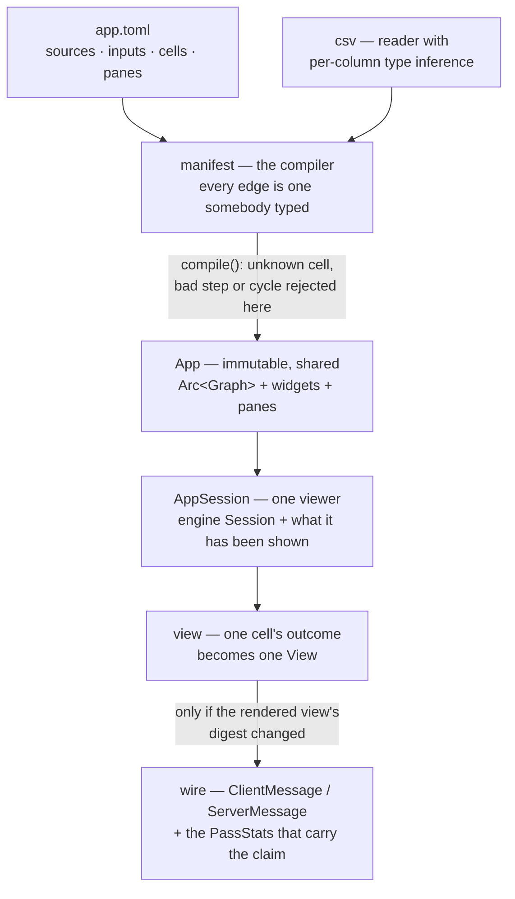
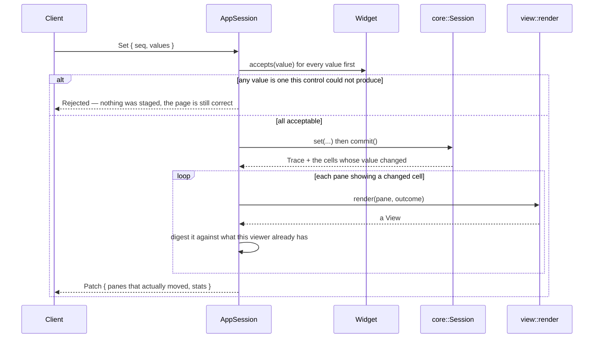

# dagpane-app — the app model

`dagpane-core` knows about cells and values. This crate knows what a slider is and what goes
on the wire — and it knows nothing about sockets, runtimes or async. `cargo test -p
dagpane-app` runs the whole patch protocol with no server in the process, which is the
property that makes the protocol testable at all.

## The invariant this crate carries alone

**A pane is not a cell.** Two panes can show one cell, a cell can drive no pane, and a cell
whose *value* changed can leave its pane's *view* identical — a table pane sending its first
fifty rows does not change when row nine thousand does.

So a patch is computed from rendered views, not from the trace: the trace says which cells to
re-render, and the rendered view's own digest decides whether it goes on the wire. Skipping
that second step would put the engine's honesty at the mercy of the renderer.

## Architecture



## What each module owns

| module | what it owns |
|---|---|
| `manifest` | TOML in, a checked `App` out |
| `view` | what a pane shows, and how one cell's outcome becomes it |
| `widget` | the controls, and `accepts` — a browser is not trusted, so a bad value is refused at the edge rather than inside somebody's compute |
| `wire` | the two messages that cross the socket, and the `stats` block |
| `csv` | a reader with per-column type inference, because the inference is the work |
| `session` | one viewer: the engine session plus what that viewer has been shown |

## Event flow



Validating every value *before* staging any of them is deliberate: a half-applied batch would
leave the viewer's controls and the session disagreeing, with no way to tell which is right.

## Quickstart

```rust
use std::collections::BTreeMap;
use std::path::Path;
use std::sync::Arc;
use dagpane_app::{load, AppSession};
use dagpane_core::Value;

let app = Arc::new(load(Path::new("examples/sales.toml"))?);
let (mut session, first) = AppSession::open(app);
session.full_views();                       // what a client gets on connect
assert_eq!(first.evaluated(), 8);           // the first render computes every cell

let mut values = BTreeMap::new();
values.insert("min_amount".to_string(), Value::float(400.0));
session.set(&values)?;
let (trace, patch) = session.commit();

assert_eq!(trace.evaluated(), 6);           // six of eleven cells ran
assert_eq!(patch.len(), 3);                 // three of seven panes went on the wire
```

```sh
cargo test -p dagpane-app
```

## Deliberately absent

No SQL and no expression language. The manifest's job is to produce **edges**, and a
dependency inferred wrongly from SQL text by a regular expression is a wrong app — a cell
that recomputes when it should not is a cost, but a cell that does not recompute when it
should is a stale number on a page that looks correct.
