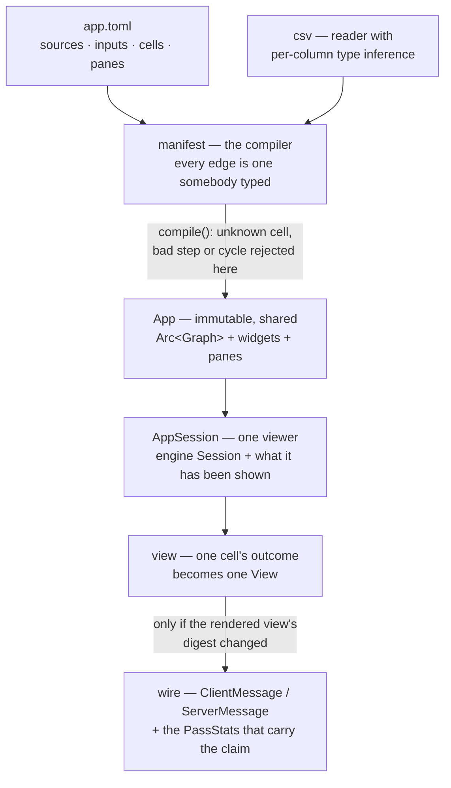
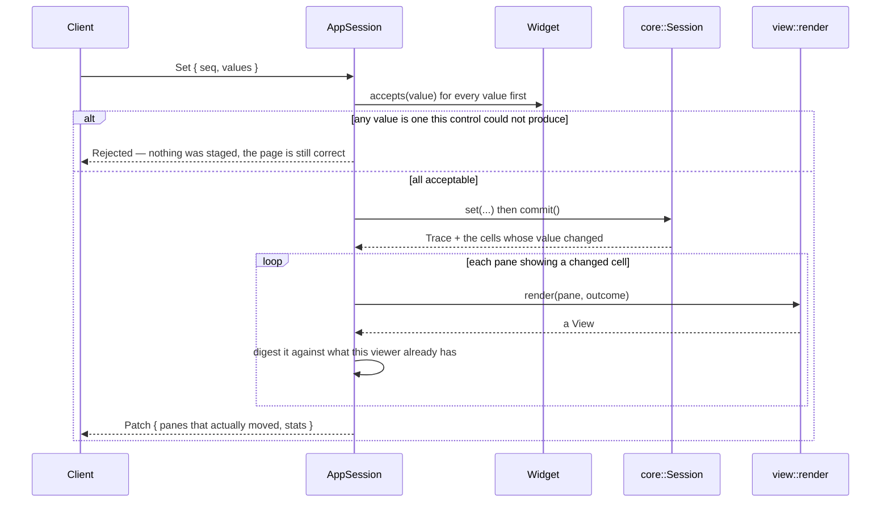

# dagpane-app — the app model

`dagpane-core` knows about cells and values. This crate knows what a slider is and what goes
on the wire — and it knows nothing about sockets, runtimes or async. `cargo test -p
dagpane-app` runs the whole patch protocol with no server in the process, which is the
property that makes the protocol testable at all.

## The invariant this crate carries alone

**A pane is not a cell.** Two panes can show one cell, a cell can drive no pane, and a cell
whose *value* changed can leave its pane's *view* identical — a table pane sending its first
fifty rows does not change when row nine thousand does.

So a patch is computed from rendered views, not from the trace: the trace says which cells to
re-render, and the rendered view's own digest decides whether it goes on the wire. Skipping
that second step would put the engine's honesty at the mercy of the renderer.

## Architecture



## What each module owns

| module | what it owns |
|---|---|
| `manifest` | TOML in, a checked `App` out |
| `view` | what a pane shows, and how one cell's outcome becomes it — five kinds this crate draws, plus `custom`, which hands the drawing to a script the client registered and keeps the decision about what goes on the wire |
| `widget` | the controls, and `accepts` — a browser is not trusted, so a bad value is refused at the edge rather than inside somebody's compute |
| `wire` | the two messages that cross the socket, and the `stats` block |
| `csv` | a reader with per-column type inference, because the inference is the work |
| `session` | one viewer: the engine session plus what that viewer has been shown |

A compiled `App` also carries a `Cut` — where each cell runs, from `place = "client"` in the
manifest, checked here so a deployment that cannot work fails at `dagpane check` rather than as
a missing pane — and the `Split` it implies, built once and shared by every session.

`AppSession::open_side` runs either half. **A pane belongs to whichever side holds its cell**,
which is why no `Pane` field says which side it is on: the cut already decides, and a second
answer could disagree. The rendered-view cache is per side, because a pane repainted in the
page must not be recorded as sent by the server. `init` carries the full frontier and `patch`
the delta, as `BoundaryValue`.

`init` also carries a `ClientHalf`, and that block is what lets a page **compile** its half
rather than merely run one. `compile_with` has to know a `[[source]]`'s column types — a CSV's
types are decided by reading it — and the whole point of cutting below the data is that the page
does not get the data. So the types cross as a shape and the rows cross afterwards as the
frontier: `ClientHalf` is the manifest plus one column list per source, `dagpane_connect`'s
`SchemaSource` is what the page compiles against, and `a_half_compiled_from_shapes_is_the_same_half`
requires the result to be identical to a half compiled from the CSV. The manifest in it is
**re-emitted from what the server parsed**, not re-read from disk: a manifest's bytes are its
identity here, and two halves built from different bytes are two different apps wearing one name.

Nothing *serves* a split yet — `dagpane-serve` opens the whole graph on purpose until a page
can hold the other half. `dagpane_core::placement` and ADR-0008 are the mechanism and the
argument; `ROADMAP.md` §4 is what is left.

## Event flow



Validating every value *before* staging any of them is deliberate: a half-applied batch would
leave the viewer's controls and the session disagreeing, with no way to tell which is right.

## Quickstart

```rust
use std::collections::BTreeMap;
use std::path::Path;
use std::sync::Arc;
use dagpane_app::{load, AppSession};
use dagpane_core::Value;

let app = Arc::new(load(Path::new("examples/sales.toml"))?);
let (mut session, first) = AppSession::open(app);
session.full_views();                       // what a client gets on connect
assert_eq!(first.evaluated(), 8);           // the first render computes every cell

let mut values = BTreeMap::new();
values.insert("min_amount".to_string(), Value::float(400.0));
session.set(&values)?;
let (trace, patch) = session.commit();

assert_eq!(trace.evaluated(), 6);           // six of eleven cells ran
assert_eq!(patch.len(), 3);                 // three of seven panes went on the wire
```

```sh
cargo test -p dagpane-app
```

## The rule the three newest verbs had to earn their way past

This section used to say there was no SQL and no expression language. There are both now, plus
a join, and the rule they had to satisfy is the one that kept them out: **the manifest's job
is to produce edges, and a wrong edge is a wrong app.** A cell that recomputes when it should
not is a cost; a cell that does not recompute when it should is a stale number on a page that
looks correct.

So an edge is never inferred from text:

| verb | where its edges come from |
|---|---|
| `derive` | the `$` tokens the expression lexer produced. A bare name is a **column**, a cell reference is **`$name`**, so `amount * rate` cannot leave a reader guessing which one `rate` is |
| `join` | the cell named in `with`, resolved by the same `bind_param` a filter's `param` uses |
| `sql` | the **resolved parse tree**, never a scan of the statement. A table name inside a comment or a string literal is not a dependency, and both are tested |

The SQL dialect is closed rather than filtered: the parser accepts only what lowers and
refuses everything else by name, which makes "refuses what it cannot resolve" a property of
the grammar instead of a blocklist somebody has to keep complete. ADR-0005 states the cost
plainly — **this is not SQL**, it is a dialect that fits on a page.

What keeps it honest is that a statement **lowers to the nine verbs and there is no second
evaluator**. `where` becomes `filter`, `group by` becomes `group_by`, a select-list expression
becomes `derive`, and by the time anything runs there is no SQL left — so nulls, type rules
and the join's duplicate-key refusal are the ones already written down and cannot acquire an
exception. `tests/sql.rs` asserts eight questions written once as SQL and once as steps,
rendering identically.
