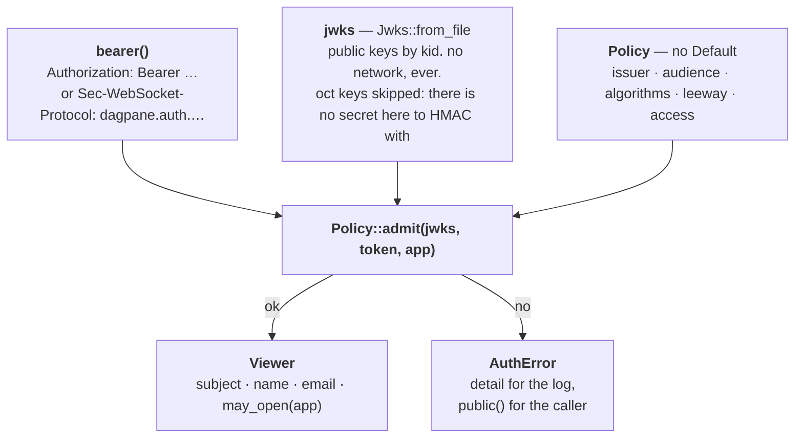
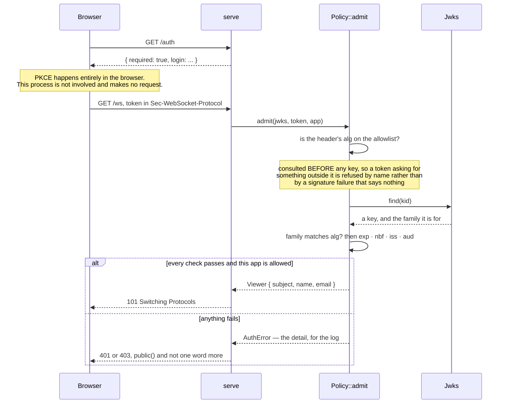

# dagpane-auth — the front door

**A resource server and nothing else.** One job: decide whether a bearer token allows its
holder to open a given app, and say precisely why when it does not.

It is off unless an operator turns it on. `--auth-jwks` is what turns it on, and without it
there is no login and no authorisation at all — `SECURITY.md` states that as a known
weakness rather than leaving it to be discovered, and the CLI prints a warning naming the
consequence for any bind that is not loopback.

## The design, stated as an absence

**This crate never talks to the identity provider.** No discovery request, no JWKS fetch, no
token exchange, and therefore no HTTP client — so the runtime's *does not phone home*
invariant survives having a front door. The operator supplies the JWKS as a **file**.

Four things follow, and each is the reason rather than a consequence somebody noticed later:

* an air-gapped install works;
* there is no start-up request that can fail, so a provider being down cannot stop this
  process from starting;
* there is nothing to redirect — no URL fetched at run time is a URL an attacker can move;
* rotating keys is a copy and a reload, which is a thing an operator already knows how to do.

The cost is stated rather than hidden: **obtaining** a token is somebody else's job. The
bundled client does the PKCE dance in the browser, which is what PKCE is for — a public
client with no secret to keep. An operator who already runs an OAuth2 proxy can skip that
entirely and hand the token over; this crate cannot tell the difference and does not want to.

## Architecture



Neither token location is a **URL**. A query string is logged by every proxy in the path, and
a credential in an access log is a credential — so `?t=` is refused even though it would have
been the easiest thing to write.

## Event flow

One connection, admitted or refused. The page is served first and without a token, because the
page is where signing in starts.



The split at the bottom is deliberate and worth stating once: the **detail** goes to the
operator's log, and the **browser** gets one of two coarse sentences. A caller who could tell
"wrong audience" from "expired" from "unknown key" can iterate towards a token that works.

## The four defaults that are not defaults

The dangerous part of a JWT is not the cryptography, which is `jsonwebtoken`'s and `ring`'s.
It is the validation, and specifically what is *not* checked when nobody said to. So `Policy`
has no `Default`, every field is required at the call site, and `Policy::check` runs at
start-up so that an unusable policy **refuses to start** rather than refusing every viewer
later — which looks the same from outside and is far harder to diagnose.

| the classic failure | why it is not reachable here |
|---|---|
| `alg: none` | the allowlist is this crate's own `Algorithm` enum, which has no such variant. An operator cannot name it. |
| `HS256` verified with the RSA public key | closed twice over: no symmetric algorithm can be allowlisted, and the JWKS loader skips `oct` keys, so there is no secret in the key set to HMAC against |
| an unchecked audience | `Policy::audience` is not optional. A token minted for another service by the same issuer is a valid token, and it is not for this one. |
| an unchecked issuer | same |

Two of them are closed **by construction rather than by a check**, which is the distinction
worth keeping: a check can be configured away and a missing enum variant cannot.
`crates/auth/tests/verify.rs` is the adversarial version of this table.

The header's algorithm is matched against the allowlist *before* a key is looked up, so a
token asking for something outside it is refused by name rather than by a signature failure
that tells an operator nothing. The key's family and the header's algorithm must then agree —
an EC key is not an RSA key — which `jsonwebtoken` would catch anyway, and catching it here
says which of the two is wrong.

## Which apps, which is this product's own question

`Access` has no default either, and the absence is deliberate in both directions. A server
that silently let any valid token open any app would be one whose access control nobody
noticed was missing; one that silently required a claim nobody mints would refuse everyone on
the first day and look broken.

```text
Access::AnyApp        every accepted token opens every app this process serves.
                      right for a single-app `dagpane run` behind something that already
                      decided who may reach it. wrong for a fleet.

Access::Claim(name)   the named claim lists the app ids its holder may open; "*" is all.
                      it must be PRESENT and an array of strings — an absent claim is far
                      more likely a misconfigured provider than a deliberate grant of
                      nothing, so it refuses.
```

A server given neither refuses to start.

## What the door does not cover

The gap is the interesting part, so `SECURITY.md` lists it and this is the same list:

* **Per-pane authorisation.** Access is per app. A viewer who may open an app sees every pane
  of it.
* **An audit of who read what.** A refusal is logged with the subject; an accepted connection
  is not.
* **Revocation before a token expires.** There is no introspection call and no deny list —
  again, because this process makes no outbound request. `--auth-leeway-secs` is small
  (`jsonwebtoken`'s own 60 seconds is a reasonable number nobody chose) and the practical
  control is a short token lifetime at the provider.
* **`/` itself.** The page is served without a token, because the page is where the sign-in
  starts. It carries no data: every value arrives over the socket, which is the thing that
  checks.

## What a viewer may be told

`AuthError` carries the detail for a **log**; `AuthError::public` is what may reach a browser,
and it is deliberately coarse — two outcomes and no detail. A caller who can tell "wrong
audience" from "expired" from "unknown key" can iterate towards a token that works, so the
distinctions exist for the operator reading a log — who does need to tell clock skew from a
misconfigured audience — rather than for the caller, and the front door stays something other
than an oracle.

`Forbidden` is the one variant where the *viewer* is real — a person who logged in and was
told no — so it is the one an operator usually wants to see, and it is `403` where everything
else is `401`. `Viewer`'s own `Debug` prints the subject and nothing else: a name and an email
are personal data, and a `{:?}` in a log line is the least deliberate way for them to leave
the process.

## Quickstart

```rust
use std::collections::BTreeSet;
use std::path::Path;
use dagpane_auth::{bearer, Access, Algorithm, Jwks, Policy};

let jwks = Jwks::from_file(Path::new("idp-jwks.json"))?;   // a file. never a URL.
let policy = Policy {
    issuer: "https://idp.example.com/".into(),
    audience: "dagpane".into(),
    algorithms: BTreeSet::from([Algorithm::RS256]),
    leeway_seconds: 5,
    access: Access::Claim("dagpane_apps".into()),
};
policy.check()?;                                   // at start-up, not per request

// both Option<&str>: the Authorization header, and Sec-WebSocket-Protocol
let token = bearer(authorization, protocols)?;
let viewer = policy.admit(&jwks, token, "sales")?;
assert!(viewer.may_open("sales"));                 // again later, without the token
```

From a shell:

```sh
dagpane host ./apps \
  --auth-jwks idp-jwks.json \
  --auth-issuer https://idp.example.com/ \
  --auth-audience dagpane \
  --auth-alg RS256 \
  --auth-apps-claim dagpane_apps
```

```sh
cargo test -p dagpane-auth
```

The tests generate a throwaway keypair each run — this repository commits no keys, so a test
that needs one has to make it.
