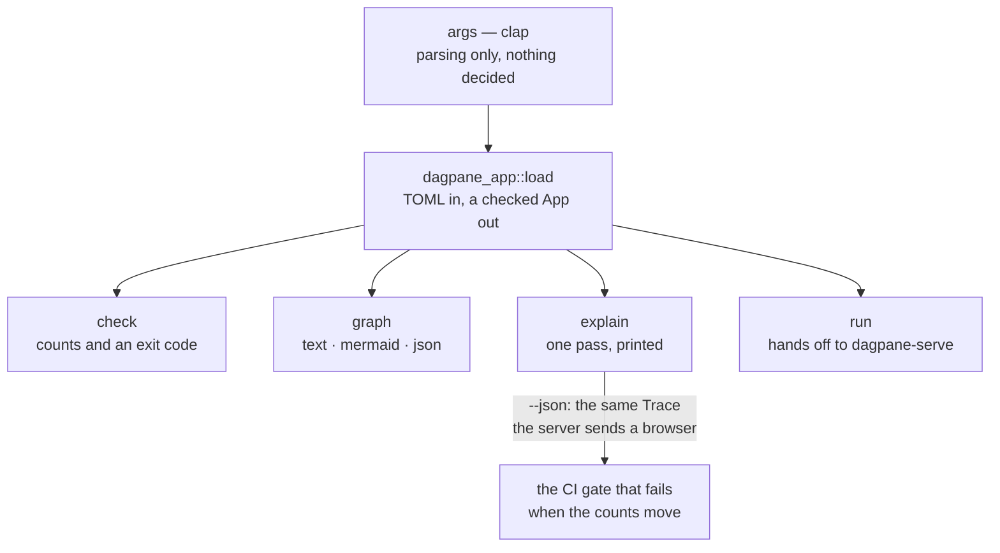
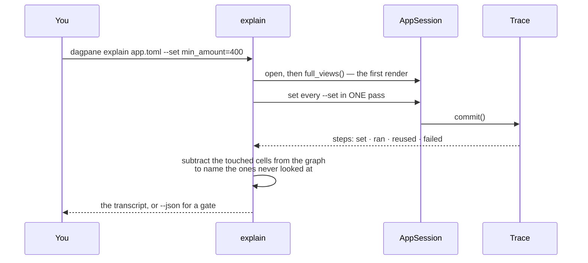

# dagpane-cli — the `dagpane` binary

Four commands, and the ordering between them is deliberate. Nothing is decided in this crate:
it parses arguments, calls `dagpane-app`, and formats. A number printed here is a number some
test in `dagpane-core` already asserted.

| command | what it answers |
|---|---|
| `check` | is this app well-formed? Exits non-zero and names what is wrong. |
| `graph` | what will the runtime actually do — before it runs. `--format text\|mermaid\|json`. |
| `explain` | what did this one interaction cost? |
| `run` | serve it. |

`check` and `graph` are only possible because the edges are written down rather than
discovered while evaluating: a runtime that finds its dependencies mid-pass has no structure
to print, nothing to diff in review, and nothing for CI to assert on.

## Architecture



## Event flow



Everything printed is read out of a `Trace` and a patch. There is no instrumentation here and
no second code path.

## Quickstart

```console
$ dagpane check examples/sales.toml
dagpane: Sales explorer — 11 cells (2 inputs, 8 computed), 7 panes
  1 data source(s) loaded at start-up and shared by every session
  ok

$ dagpane explain examples/sales.toml --set min_amount=400
dagpane: Sales explorer — 11 cells, 7 panes
first render: 8 of 11 cells evaluated

set min_amount = 400
  epoch 2 — looked at 8 of 11 cells
    set      min_amount
    ran      filtered             changed
    ran      order_count          changed
    ran      region_totals        changed
    ran      channels             same value — nothing below it ran
    ran      top_orders           same value — nothing below it ran
    ran      revenue              changed
    reused   channel_count        its inputs had not moved
  3 cell(s) never looked at: sales, region, all_time_revenue
  patch: 3 of 7 panes — revenue, order_count, region_totals

$ dagpane run examples/sales.toml
dagpane: http://127.0.0.1:8787
```

`--json` emits the same figures for a CI gate to assert on; this repository's own CI does
exactly that and fails the build when they move.

```sh
cargo test -p dagpane-cli
```
