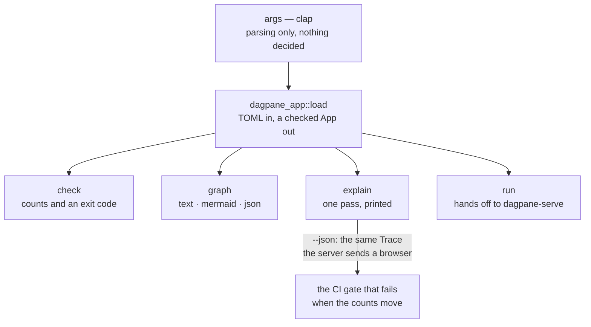
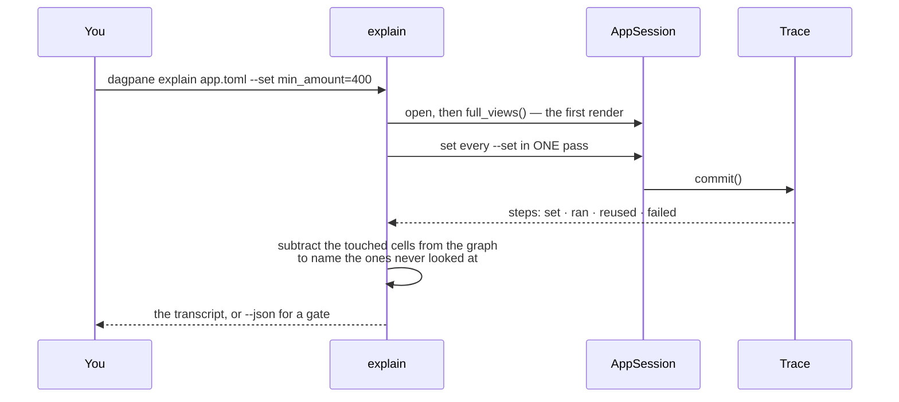

# dagpane-cli — the `dagpane` binary

Eight commands, and the ordering of the first four is deliberate. Nothing is decided in this
crate: it parses arguments, calls `dagpane-app`, and formats. A number printed here is a number
some test in `dagpane-core` already asserted.

| command | what it answers |
|---|---|
| `check` | is this app well-formed? Exits non-zero and names what is wrong. Also reports the **cut**, for an app that placed any cell with `place = "client"`: how wide the frontier is, and how many controls would need no network. |
| `graph` | what will the runtime actually do — before it runs. `--format text\|mermaid\|json`. |
| `explain` | what did this one interaction cost? `--set`, and `--change-column` for what the *data* moving costs. |
| `run` | serve it, here, now. Loopback, a URL printed, and you to stop it. |
| `serve` | serve it as one replica of however many. Every interface, `/healthz` and `/readyz` on a listener you do not publish, a drain that goes unready before it stops accepting, `SIGTERM`, and the origins you publish it at. |
| `refresh` | re-read the sources and print what that cost. `--force`, `--watch`. |
| `host` | serve every manifest in a directory from one process, routed by the `Host` header. Operated like `serve`: probes, a drain, and an idle sweep that actually runs. Readiness is whether this process can compile and serve — **not** whether every app it holds is healthy. |
| `export` | write it as static files with the engine compiled into the page — no server. |

`check` and `graph` are only possible because the edges are written down rather than
discovered while evaluating: a runtime that finds its dependencies mid-pass has no structure
to print, nothing to diff in review, and nothing for CI to assert on. Placement is the newest
thing that rides on it: whether a cut is admissible is a question about **edges**, so it is
decided by structure and never by data.

That is a statement about the *check*, not about the command. `check` compiles the app, and
compiling loads every source — so an unreadable CSV stops it before it reaches placement at
all. `graph` is the one that answers a structural question without executing a cell.

`check` says on every placed app that **no command here serves a split yet** — `run`, `serve`
and `export` evaluate every cell on their own side whatever `place` says. ADR-0008 says why that
is written down rather than quietly implied.

## Architecture



## Event flow



Everything printed is read out of a `Trace` and a patch. There is no instrumentation here and
no second code path.

## Quickstart

```console
$ dagpane check examples/sales.toml
dagpane: Sales explorer — 11 cells (2 inputs, 8 computed), 7 panes
  1 data source(s) loaded at start-up and shared by every session
  ok

$ dagpane explain examples/sales.toml --set min_amount=400
dagpane: Sales explorer — 11 cells, 7 panes
first render: 8 of 11 cells evaluated

set min_amount = 400
  epoch 2 — looked at 8 of 11 cells
    set      min_amount
    ran      filtered             changed
    ran      order_count          changed
    ran      region_totals        changed
    ran      channels             same value — nothing below it ran
    ran      top_orders           same value — nothing below it ran
    ran      revenue              changed
    reused   channel_count        its inputs had not moved
  3 cell(s) never looked at: sales, region, all_time_revenue
  patch: 3 of 7 panes — revenue, order_count, region_totals

$ dagpane run examples/sales.toml
dagpane: http://127.0.0.1:8787
```

`--set` asks what a *control* costs. `--change-column CELL.COLUMN` asks what the **data**
moving costs — it rewrites one column of one source frame and reports the same figures:

```console
$ dagpane explain examples/apps/19-wide-telemetry.toml --change-column metrics.disk_sdb_write_ops
changed column `disk_sdb_write_ops` of `metrics` — 1 of 122 columns (a synthetic edit: every value in it nudged, the frame's shape held)
  epoch 2 — looked at 10 of 11 cells
  changed 1 column of a 122-column frame; recomputed 0 of 11 cells
  patch: 0 of 9 panes — nothing to send
```

The table changed and nothing ran, because no column any cell reads had moved. Give both and
the controls settle in their own pass first, so the column change is still the one thing
measured — which is how you ask what a data change costs at a threshold other than the
manifest's default:

```console
$ dagpane explain examples/apps/19-wide-telemetry.toml --set busy_cpu=40 --change-column metrics.cpu0_user
  changed 1 column of a 122-column frame; recomputed 0 of 11 cells

$ dagpane explain examples/apps/19-wide-telemetry.toml --set busy_cpu=35 --change-column metrics.cpu0_user
  changed 1 column of a 122-column frame; recomputed 4 of 11 cells
```

Three cells filter on `cpu0_user` and every value in it moved. At a floor of 40 the same 129
of 204 rows clear it before and after, so none of them can have a different answer; at 35,
three rows cross. A fourth cell *ranks* by that column and averages memory over the top ten;
it sleeps through both, because nudging every value leaves the ranking standing. The edit is synthetic — every value nudged, the frame's shape held — and the
output says so. A column that is entirely null is an error rather than a misleading zero.

`--json` emits the same figures for a CI gate to assert on; this repository's own CI does
exactly that and fails the build when they move.

```sh
cargo test -p dagpane-cli
```
