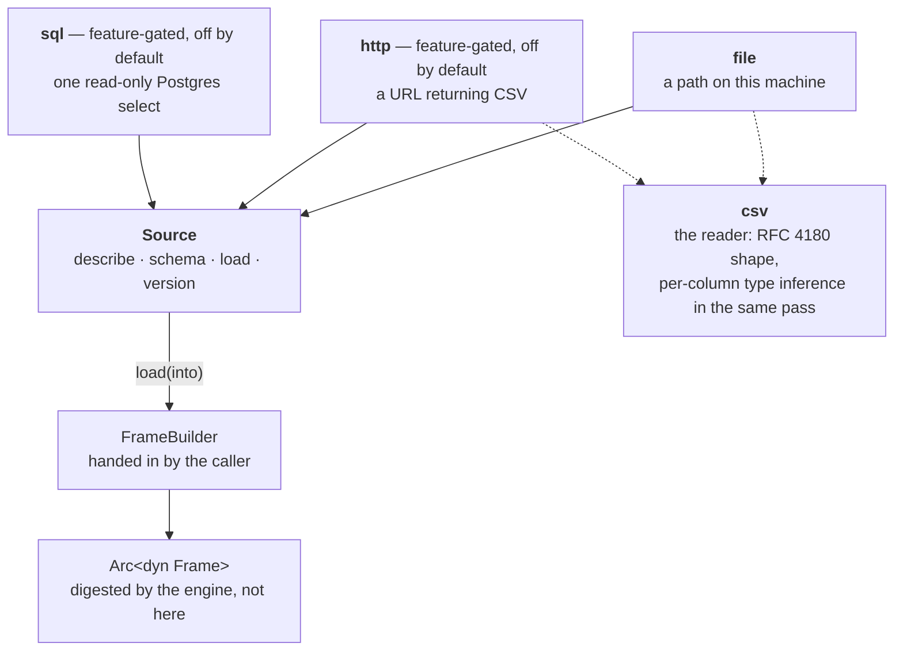
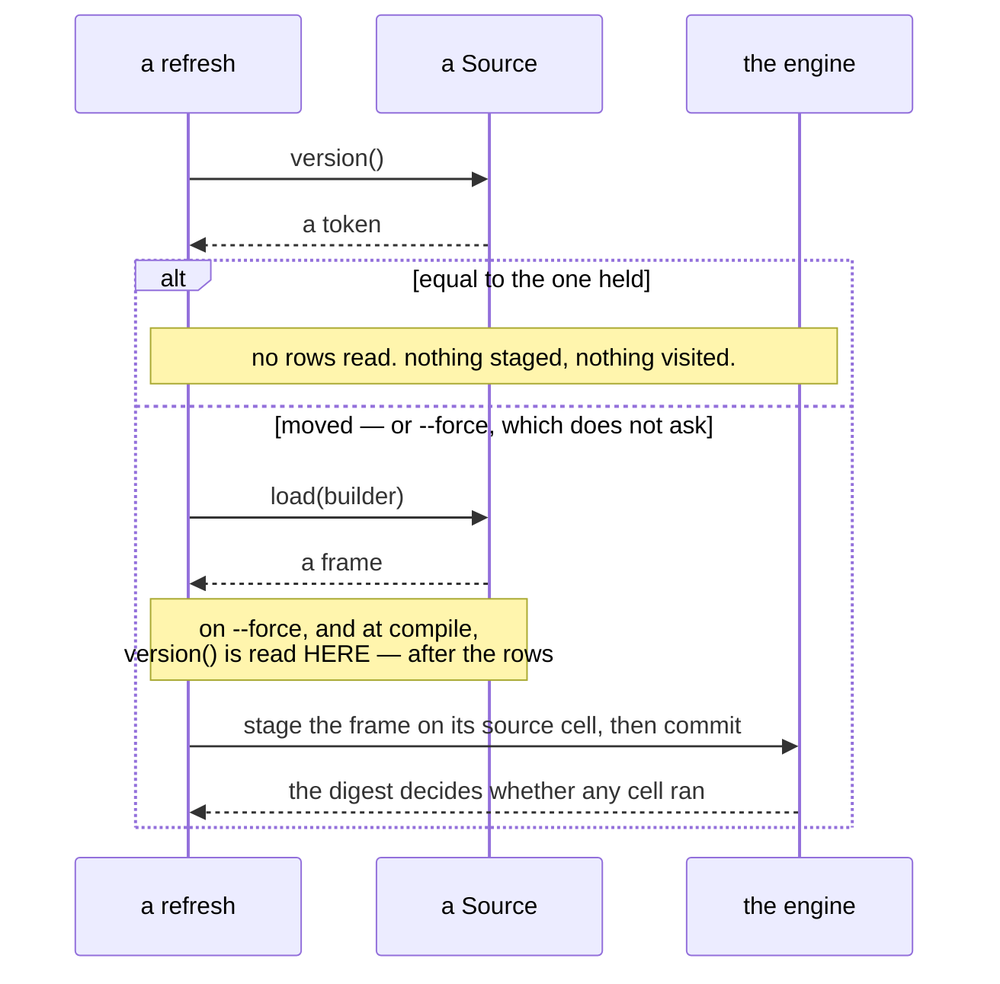

# dagpane-connect — where a source's rows come from

**One trait, three implementations, and no query engine.** A source produces a whole frame;
the engine's contract with a value is *produce it, digest it, compare the digest*, and
nothing here changes that contract. Predicate pushdown, incremental loading and streaming are
deliberately absent — they change how long a load takes, never what it means.

This is also the only crate in the workspace permitted a network client, and both of them are
off by default. `ARCHITECTURE.md` §2 states the rule and names what CI actually checks: not
that this manifest says `optional`, which some other crate's default feature could quietly
undo, but that `cargo tree` on a default `dagpane-cli` resolves neither an HTTP stack nor a
database driver.

## The two questions, and why they are two

| | what it reads | what it costs |
|---|---|---|
| `version()` | metadata, no rows | one `stat`, one `HEAD`, one `count(*)` |
| `load()` | the rows | the whole source |

Splitting them is the point of the trait. A scheduled refresh asks the cheap question on
every tick and the expensive one only when the answer moved, so a refresh over an untouched
source costs one `stat` and repaints nothing.

**A `Version` is not a content digest, and confusing the two is the mistake this crate is
arranged to prevent.** It is the source's own claim about its own metadata — a modification
time and a length, an `ETag`, a row count — comparable only against an earlier claim by the
same source. There is deliberately no ordering on it: the only question it answers is "is
this the same one I saw last time?".

It is never the last word either. An unequal version causes a *load*, and the engine's digest
of the loaded frame is what decides whether any cell recomputes. So a version that moves when
the data did not costs one wasted read. The direction it must never be wrong in is the other
one — equal over data that *did* change, because then nothing is read and a viewer sees a
stale number that looks fresh — and each implementation states when that can happen to it.

## Architecture



`load` takes the builder it should fill rather than returning a table. The caller chooses the
representation and the source fills it directly, so nothing in between materialises a copy
for somebody else to convert — which is where the measured memory win on the bundled example
comes from. `BENCHMARKS.md` has the figures.

## The three sources

| implementation | feature | how it versions itself | where an equal version can lie |
|---|---|---|---|
| `FileSource` | always | modification time and length | a rewrite inside the filesystem's timestamp granularity that leaves the length identical |
| `HttpSource` | `http` | `ETag`, else `Last-Modified` | a server that sends a wrong validator. With none at all the source reports a version that never repeats, so it reloads every tick rather than risk the stale answer |
| `SqlSource` | `sql` | row count, plus the `max` of a watched column | an `UPDATE` that moves no row count — which is why `watching("updated_at")` is advice and not an option |

`http` and `sql` are off by default because the invariant they weaken was worth something: *a
data-app runtime that can phone home is not one anybody self-hosts.* What makes weakening it
acceptable is the shape rather than the intention — one crate, both clients `optional`, both
features off, and the resolution checked rather than the manifest. Both present a **blocking**
API — `ureq` rather than `reqwest`, and the synchronous `postgres` client — so a source that
reads a network does not oblige anything below `crates/serve` to become async.

## The ordering rule: a version is taken after the load



**Where a version is recorded alongside rows that were just read, it is read after them.**
`manifest::compile` does this and so does `dagpane refresh --force`. A version taken first and
rows taken second records the state of a file that may have been rewritten between the two,
and every later refresh then compares against a version the data never had — so the source
goes permanently stale while every check says it is current. Read second, the mistake can
only go the other way: it over-reports a change, and that costs one reload.

## Quickstart

In a manifest — `csv` is the short form of `file`, and the two gated forms name their feature:

```toml
[[source]]
name = "sales"
csv = "sales.csv"          # relative to the manifest, never to the working directory
refresh_secs = 300

[[source]]
name = "orders"
sql = { dsn = "postgres://readonly@db/app", query = "select * from orders", watch = "updated_at" }
```

In Rust:

```rust
use dagpane_connect::{FileSource, FileFormat, Source};
use dagpane_core::frame::TableBuilder;

let source = FileSource::new("examples/sales.csv", FileFormat::Csv);
let before = source.version()?;
let frame = source.load(Box::new(TableBuilder::new()))?;

assert_eq!(source.version()?, before);   // nothing touched it, so nothing is re-read
```

```sh
cargo test -p dagpane-connect
cargo test -p dagpane-connect --features http
DAGPANE_TEST_PG_URL=postgres://user@127.0.0.1:5432/postgres \
  cargo test -p dagpane-connect --features sql
```

The SQL tests skip loudly rather than silently when no database is named, and CI sets
`DAGPANE_REQUIRE_PG` so that a skip there is a failure.

## Errors, and the one question a scheduler has

Three variants, flat rather than a chain of wrapped causes: a person reading one is deciding
whether the problem is theirs or the source's, and three levels of `source()` to reach
"connection refused" is three levels between them and that answer.

`Unreachable` and `Unreadable` are the source's; `Misconfigured` is the only one a **retry
cannot fix** — a URL that is not a URL, a statement that is not one `select`, a format this
build was not compiled with. They are kept apart because merging them is how a refresh
scheduler ends up retrying a typo every five minutes forever, and `SourceError::is_retryable`
answers that question once instead of in each scheduler.

`Source::describe` is what every one of those errors renders, so **it must never carry a
credential.** A DSN's password, a token in a query string, a bearer header: each
implementation states what it redacts, because this string ends up in a log that ends up in a
bug report.

## Deliberately absent

No async runtime, no socket this crate listens on, and nothing above `dagpane-core` in the
dependency arrow — `connect` does not know what a pane is.

No format but CSV yet, and `FileFormat` is an enum with one variant anyway. The shape it
replaces is the one the manifest still carries as a short form — a bare `csv = "sales.csv"`
field — and with only that, adding Parquet would have meant changing the manifest type, the
compiler and the reader in one go.
