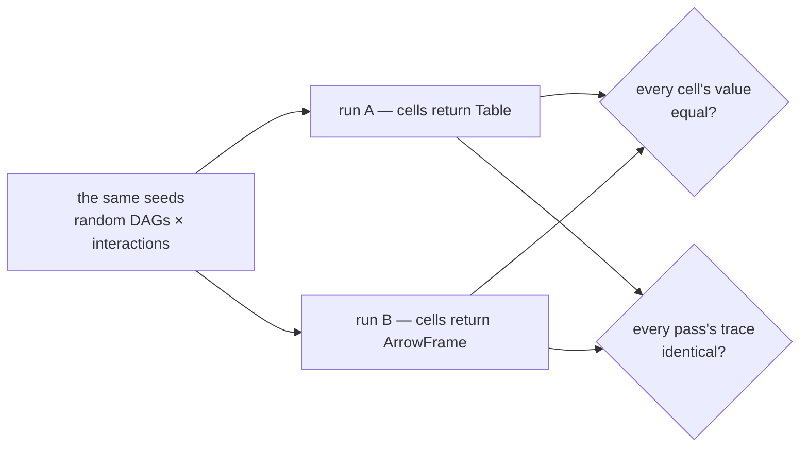
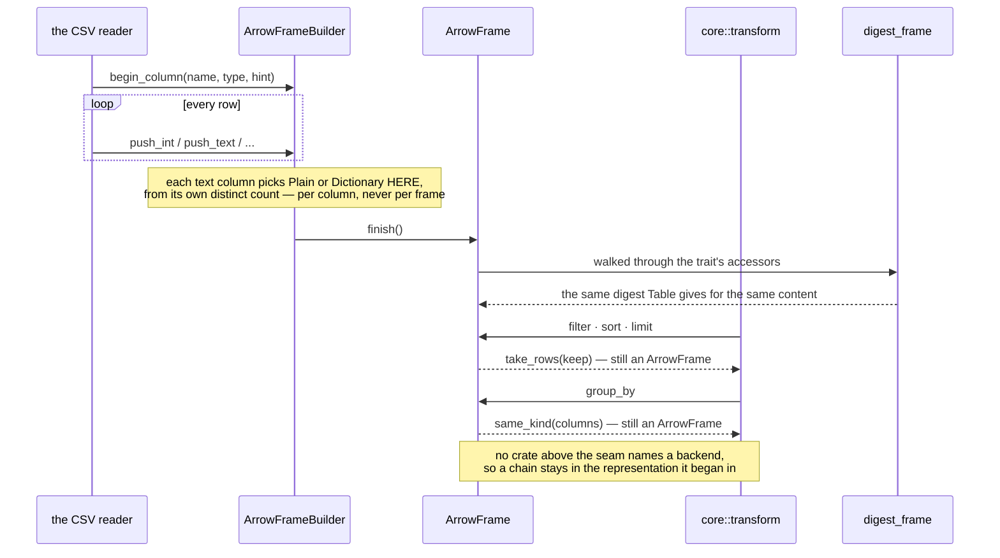

# dagpane-frame-arrow — the Arrow backend behind the `Frame` seam

**Same logical content as `dagpane_core::Table`, same digest, a fraction of the memory.**
Contiguous buffers instead of `Vec<Option<T>>`, and dictionary encoding for low-cardinality
text.

`ARCHITECTURE.md` §6 described this seam before there was anything behind it, and said the
trait was the plan and the code was not. It exists now, and it shipped with **two** backends
rather than one — a trait with a single implementation is a design fitted to that
implementation, and there is no second caller to discover what it got wrong.

What has not changed is where a dependency may live. `dagpane-core` is still serde and
nothing else, so the crate where the product's claim can be *wrong* stays auditable line by
line, and a backend is only a place where it can be *slow*.

## The invariant: this must not change the digest

`dagpane_core::frame::digest_frame` walks any frame through the trait's own accessors, so it
sees logical values and cannot see layout. This crate delegates to it rather than hashing its
own buffers, so a dictionary-encoded column and a plain one holding the same strings hash
identically **by construction**.

That is not cosmetic. The digest is what decides whether a cell's output moved, so a backend
that hashed its own layout would invalidate every cell in the graph the moment anybody
switched representation — while looking exactly like a correct pass. ADR-0003 is the decision
this protects.

**`tests/oracle.rs` is what holds it there.** `dagpane-core`'s own oracle proves incremental
evaluation agrees with a full recompute; it cannot prove anything about representations,
because core knows one. This one runs the same corpus twice over the same seeds — once with
frame-valued cells returning `Table`, once returning `ArrowFrame` — and asserts the two runs
are indistinguishable:



The second assertion is the interesting one. The short-circuit is driven by content digests,
so if a backend's digest disagreed with `Table`'s **by one bit**, cells would recompute in one
run and be reused in the other and the traces would diverge — visited, evaluated and reused
counts included. A digest bug cannot hide from that. It lives here rather than in core because
it needs both backends, and core must not depend on one of its own backends.

## What the encoding is worth, and where it is not

One 1M-row four-value categorical column — which is exactly what `region` and `channel` are
in the bundled example:

| | resident |
|---|---:|
| `Vec<Option<String>>` | 27.2 MB |
| `arrow::StringArray` | 11.8 MB |
| `arrow::DictionaryArray` | 3.8 MB |

**Note the middle row.** Adopting Arrow is worth 2.3×; the 7.1× is dictionary encoding. A
backend that stores every string contiguously and stops there leaves most of the win on the
table, so this one encodes by default and says so.

The decision is **per column**, not per frame, because the win is not uniform. Over the
bundled example's six columns it is 4.1× — `day`, `region` and `channel` encode (28, 4 and 4
distinct values); `order_id` and the two numerics do not. Two guards decide it:

* `DICTIONARY_MAX_DISTINCT` (4096) — past a few thousand entries the dictionary stops being a
  lookup and starts being a second copy of the column;
* `DICTIONARY_MAX_RATIO` (0.5) — at one distinct value per two rows the codes cost about what
  the strings saved, and past that the encoding is a loss. A column of a million distinct
  values is *larger* encoded.

**And the end-to-end figure is 41%, not 4.1×.** `BENCHMARKS.md` states the gap rather than
hiding it: the source is Arrow-backed, the *derived* frames largely are not. `filter`, `sort`
and `limit` return whatever their input was, so a chain of those stays Arrow — but `group_by`
aggregates into a `Table`, and several of the bundled app's eleven cells are group-bys. The
4.1× is what one representation costs; the 41% is what a whole session costs when only part
of it has moved.

## Event flow

One source load, then a chain of verbs over what it produced. The encoding decision happens
once, at the bottom; everything above it is the seam doing its job.



Two things in that diagram are the whole design. The digest is taken **through the trait**, so
it cannot see layout and a dictionary-encoded column agrees with a plain one by construction.
And `group_by` — the one verb that builds rows rather than selecting them — asks its *input*
to build the result, because `transform.rs` lives in a crate that must not depend on any
backend.

## Where it is switched on

`crates/app`'s `arrow-sources` feature, **on by default**: a loaded source fills an
`ArrowFrameBuilder` rather than a `TableBuilder`. The reader fills the backend's arrays
directly, so nothing in between materialises a representation for somebody else to convert.
Turning the feature off gives back the lean build, and the two arms are observably identical
— same values, same schema, same digest, so the same cells recompute and the same panes go on
the wire.

Only three arrow sub-crates, never the umbrella: `arrow-array`, `arrow-schema`, `arrow-select`.
The umbrella would add csv, json, ipc and ffi for nothing, and the engine choice was made on a
measured 259 KiB gzipped — including the `wasm32` build size of every candidate, so the WASM
question was answered before the dependency was taken rather than after.

## Quickstart

```rust
use dagpane_core::frame::{frame_digest, Frame};
use dagpane_core::value::{Column, Table};
use dagpane_frame_arrow::{ArrowFrame, Encoding};

let columns = vec![
    Column::int("order_id", (0..1_000).map(|i| Some(i as i64)).collect()),
    Column::text("region", (0..1_000).map(|i| Some(["north", "south"][i % 2].into())).collect()),
];

let arrow = ArrowFrame::from_columns(&columns);
let table = Table::new(columns.clone())?;

assert_eq!(arrow.encodings()[1], Some(Encoding::Dictionary));   // two distinct values
assert_eq!(frame_digest(&arrow), frame_digest(&table));         // the invariant, in one line
assert!(arrow.memory_size() < table.memory_size());
assert_eq!(arrow.backend(), "arrow");
```

```sh
cargo test -p dagpane-frame-arrow                                 # including the oracle
cargo run --release -p dagpane-frame-arrow --example memory 1000000
```

The example prints what both representations cost on the bundled example's column shape, six
columns as `examples/sales.csv` has them — which is how the per-column numbers above were
produced rather than asserted.

## Deliberately absent

No compute. This crate stores columns and answers the `Frame` trait; `filter`, `sort`,
`group_by` and the rest stay in `dagpane-core::transform`, where one implementation serves
every backend. Chunking, SIMD and a query planner are not here either — the row count this
runtime is honest about is roughly a hundred thousand, and past that the answer is to
aggregate upstream rather than to grow a second engine inside the one place the product's
claim is asserted.
