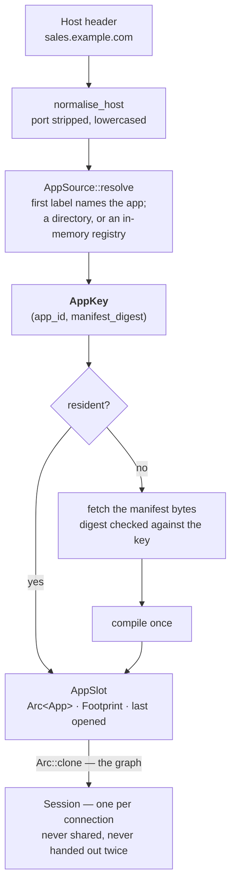

# dagpane-host — many apps in one process

`dagpane run` binds a port and serves one manifest. Hosting four hundred apps that way means
four hundred processes, which is already cheaper than four hundred Python containers — and
"cheaper" is a word, not a number. This crate is what makes it a number: **one process, `N`
apps, one compiled graph each, and a byte budget that decides which ones stay resident.**

`BENCHMARKS.md` has the number this crate exists for: **224 apps on one core**, at 448
concurrent sessions and 1 908 interactions per second, measured — against 200 predicted by a
service-demand model built from a separate rig that shares no code with it.

## The key is the whole design



`AppKey` names an app **and the manifest it was compiled from**, so a redeploy is a different
key rather than a mutation of the same one. Three things fall out of that, and none of them
needed a mechanism of its own:

* a viewer who reconnects after a deploy cannot be served the graph that was deployed over,
  because that graph is under a key nothing resolves to any more;
* a rollback is a key change, so the host does the work of a rollback by being told a
  different digest — there is no rollback path to get wrong;
* two processes holding one key hold the same graph, because the key names the bytes.

`AppId` is a DNS label, validated on construction and **not normalised**: `Sales` is refused
rather than lowered to `sales`. An identifier that changes when you write it differently is
two identifiers wearing one name, and where that difference surfaces is a registry lookup
that misses and deploys a second copy.

## Event flow

One request resolving to a session. The hit path is the one to read first — it is what happens
several hundred times a second.

```mermaid
sequenceDiagram
    participant R as a request
    participant H as Host
    participant S as AppSource
    participant C as compile

    R->>H: open("sales.example.com")
    H->>S: resolve(host) — reads the manifest's bytes
    S-->>H: AppKey { app_id, manifest_digest }

    alt already resident
        Note over H: a read lock, a hash lookup, an Arc clone,<br/>and a relaxed store of last-opened.<br/>No writer is woken and nothing is allocated.
        H-->>R: Arc&lt;App&gt;
    else miss
        H->>S: fetch(key)
        S-->>H: bytes — checked against the key by the HOST,<br/>which is the side that does not trust the answer
        H->>C: compile, OUTSIDE the lock
        Note over H,C: compiling reads the app's sources; holding a write<br/>lock across a disk read would stall every other<br/>app's hit path for the duration
        C-->>H: an App, and its Footprint
        Note over H: admission: over budget evicts the least<br/>recently opened, or refuses outright
        H-->>R: Arc&lt;App&gt;
    end

    R->>H: session(host)
    H-->>R: its own slots over that shared graph
```

The last exchange is the one with no alternative branch, and that is the point: there is no
path here that hands back a session somebody else is also holding.

## Isolation: the graph is shared, the session is not

One process serving many parties' apps makes isolation a property of a data structure rather
than of a database, and the rule is one line. `Host::open` hands out `Arc<App>` — immutable,
compiled once — and every connection builds its own `dagpane_core::Session` over it.

**There is deliberately no call here that returns a session somebody else is also holding**,
because that is not a cache hit: it is one viewer reading another viewer's inputs.

`tests/isolation.rs` is that sentence made adversarial — thirteen tests, including the *same
manifest bytes* deployed under two app ids with both sessions open, one setting an input and
the other's panes asserted not to move. It runs with nothing listening on anything, which is
the point of the crate having no runtime in it: a runtime here would make the isolation test
the kind that needs a socket, and that is exactly the test that then gets skipped.
`ARCHITECTURE.md` §2 states the same rule from the workspace's side.

## The budget is bytes, because bytes are what was measured

Eviction is a byte budget rather than a count or an LRU guess, and that is only possible
because `Frame::memory_size` is a number every backend answers about its own storage. So
"what does this app cost" has an answer that was measured rather than assumed.

`Footprint` is three numbers. `source_bytes` is the one that decides; `source_rows` and
`cells` are what a person reads when they want to know *why* an app is expensive.

**`source_bytes` is the app's data, not the process's.** It excludes the graph's nodes, the
compiled pipelines, every session's slot vector and the allocator's slack. Those are real and
they are not in it — for the reason the crate exists: the sources are what a second *app*
adds and a second *viewer* does not, so they are what a budget over apps can honestly be
written in. Nothing here predicts RSS from it.

| `EvictReason` | when |
|---|---|
| `Redeployed` | a new manifest was published for this app. The old key goes immediately and is not left to be found. |
| `OverBudget` | admission would exceed `max_bytes`, and this was the least recently opened |
| `Idle` | nobody opened it within `idle_after`, **and a sweep ran** |

Two rules about that table are worth keeping:

* **An app larger than the whole budget is refused, not admitted and then evicted.** Admitting
  it would evict every other app first and still fail, which turns one oversized deploy into
  an outage for everything else on the node.
* **`sweep_idle` has a caller now.** `dagpane_serve::sweep_idle` runs it on a timer at half
  the idle window and prints what went. This crate still owns no clock, which is why the timer
  is not here — and for three releases that meant nothing ran it at all, so `--idle-minutes`
  configured a sweep that did not exist.
* **Nothing is evicted for being idle on the request path.** Only `sweep_idle` acts on
  `idle_after`, because the request path is the one place where the cost of being wrong is a
  user waiting for a recompile. A caller that never calls it gets no idle eviction at all,
  which is the state `dagpane host` is in today — `ROADMAP.md` §1 tracks wiring it up.

`Budget::new` makes both numbers explicit at the call site — there is no default that is right
for two machines, and a host that picks one silently is a host whose eviction is a surprise.
Every eviction is recorded in a bounded log (`Host::evictions`) rather than inferred from a
later cache miss; unbounded, it would be a memory leak with a good excuse.

## Quickstart

```sh
dagpane host ./apps --budget-mb 512 --idle-minutes 60
```

`apps/sales.toml` becomes the app `sales`, reachable at any name whose first label is `sales`
— `sales.example.com`, `sales.localhost:8787`, or a bare `Host: sales`. A filename that is not
a DNS label is skipped and reported at start-up. Editing a manifest changes its digest, so the
next request compiles the new one and the old graph is evicted: **there is no deploy step.**

```rust
use std::sync::Arc;
use std::time::Duration;
use dagpane_host::{Budget, DirAppSource, Host};

let source = Arc::new(DirAppSource::new("./apps"));
let host = Host::new(source, Budget::new(512 << 20, Duration::from_secs(3600)));

let app = host.open("sales.example.com")?;   // compiles on the first open, then Arc::clone
let session = host.session("sales.example.com")?;   // this viewer's own slots over that graph

for gone in host.sweep_idle() {
    eprintln!("evicted {} — {} ({} bytes)", gone.key, gone.reason, gone.bytes);
}
```

```sh
cargo test -p dagpane-host
```

## Deliberately absent

No socket, no async runtime, and no clock beyond `std::time::Instant`. Multiplexing is a
decision about a map — which key, which lifetime, which budget — and every one of those
decisions is testable with nothing listening on anything. `crates/serve` owns the socket and
drives this.
