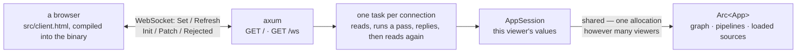

# dagpane-serve — the process

**A socket, a clock, and the loop that joins them to the engine.**

Everything interesting already happened in `dagpane-app`. This crate adds the three things
that cannot be tested without a machine — an address to bind, a clock to measure a pass with,
and a browser to send bytes to — and it adds nothing else. That is why it is the smallest
crate here, and why the two below it have no `tokio` in their dependency trees.

## Architecture



## The session model, stated plainly

**A session is a connection.** Opening the page creates one; closing the tab discards it.
There is no session store, no eviction policy, no TTL and no reconnection token, because
there is no state to lose that cannot be recomputed from the app's defaults in one pass — and
a store that exists before anybody needs it is a store whose eviction bug ships before its
feature does.

What the model *does* buy is the part that matters: the app — the graph, the compiled
pipelines, and every loaded source — is one `Arc<App>` behind every connection. A hundred
viewers of a 600-row app are a hundred slot vectors over one table, not a hundred copies of
it, and `crates/core/tests/oracle.rs` asserts the pointer identity that makes that true
rather than measuring RSS and hoping.

## Event flow

```mermaid
sequenceDiagram
    participant B as Browser
    participant C as connection task
    participant A as AppSession

    B->>C: GET /ws (upgrade)
    C->>A: open — the first pass computes everything
    C-->>B: Init { title, widgets, panes, views, stats }
    Note over B: the stats bar renders the first pass's cost

    B->>C: Set { seq, values }
    C->>A: set + commit, timed here — core has no clock
    A-->>C: Trace + only the panes that moved
    C-->>B: Patch { seq, panes, stats { visited, evaluated, untouched, micros } }

    B->>C: Close
    Note over C,A: the session is dropped; Arc&lt;App&gt; is not
```

The loop is deliberately sequential: a message is read, a pass runs, a patch goes out, and
only then is the next message read. Concurrency inside one connection would buy nothing and
would cost the guarantee that the viewer's controls and their page describe the same epoch.

## The client

`src/client.html` is the whole front end: one file, inline CSS and JavaScript, no package
manager, no bundler, and nothing fetched at run time — a test asserts that the only URL in it
is the SVG namespace. Two things follow. The first five minutes of using this project do not
involve `npm install`, and an app served on an air-gapped host renders.

The stats bar at the top of the page is not decoration. For every interaction it prints how
many of the app's cells the pass looked at, how many ran, how many produced a new value, and
how many panes actually went on the wire. Open the network tab and check it against the
frames.

## Quickstart

```rust
use std::path::Path;
use std::sync::Arc;

let app = Arc::new(dagpane_app::load(Path::new("examples/sales.toml"))?);
dagpane_serve::serve(app, "127.0.0.1:8787".parse()?).await?;
```

Or, from a shell:

```sh
dagpane run examples/sales.toml       # http://127.0.0.1:8787

cargo test -p dagpane-serve                 # the client's self-containment
cargo test -p dagpane-serve --test socket   # the real wire, over a real socket
```

## Security posture

**There is no authentication in this version.** The server binds `127.0.0.1` by default and
the CLI prints a warning naming the consequence when told to bind anything else. See
`SECURITY.md`.
