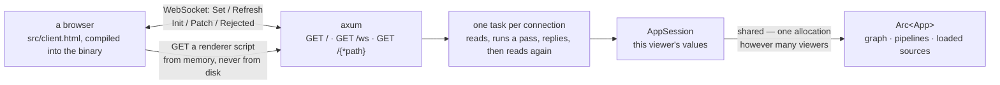
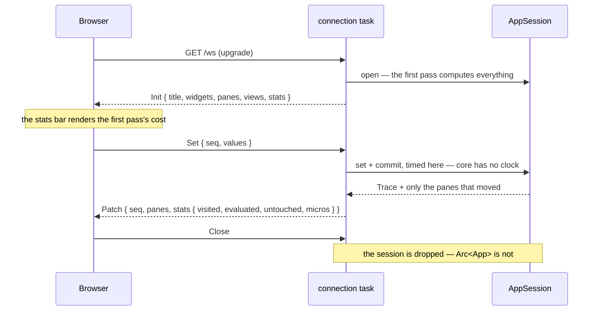

# dagpane-serve — the process

**A socket, a clock, and the loop that joins them to the engine.**

Everything interesting already happened in `dagpane-app`. This crate adds the three things
that cannot be tested without a machine — an address to bind, a clock to measure a pass with,
and a browser to send bytes to — and it adds nothing else. That is why it is the smallest
crate here, and why the two below it have no `tokio` in their dependency trees.

## Architecture



## The session model, stated plainly

**A session is a connection.** Opening the page creates one; closing the tab discards it.
There is no session store, no eviction policy, no TTL and no reconnection token, because
there is no state to lose that cannot be recomputed from the app's defaults in one pass — and
a store that exists before anybody needs it is a store whose eviction bug ships before its
feature does.

What the model *does* buy is the part that matters: the app — the graph, the compiled
pipelines, and every loaded source — is one `Arc<App>` behind every connection. A hundred
viewers of a 600-row app are a hundred slot vectors over one table, not a hundred copies of
it, and `crates/core/tests/oracle.rs` asserts the pointer identity that makes that true.

**What that sentence does not say, now that it has been measured**: the *sources* are shared and the frames each session **computes** are not — two viewers with two filters must have two answers. A session of the bundled example costs about 8.5× the CSV it shares, and one whose pipeline keeps rows costs about a table again. `BENCHMARKS.md`, *What one more viewer costs*.

## A pass runs on the worker that owns the connection

`apply` is an ordinary `fn` called from the connection's `async fn`: `session.commit()` runs
inline on a tokio worker, not on a blocking pool. There are as many workers as the affinity
mask allows, so **a pass occupies one of them for its whole duration** and the connections
scheduled behind it wait.

That was reasoned from this source for a long time before it was a number. It is measured now
(`BENCHMARKS.md`, *What a viewer costs while they are using it*), and the number is the
difference between the two ends of the sweep rather than a single figure. A viewer who is
doing nothing at all — asking only for the state it already holds — is answered in **0.4 ms**
when nobody else is busy. With 64 viewers dragging a slider on the bundled example, whose pass
is under a millisecond, it is answered in **9.0 ms**. With 64 viewers dragging on a 200 000-row
app, whose pass is 148 ms, it waits **2.3 seconds**.

**Every one of those is a median over the probes that came back**, and an earlier version of
this paragraph quoted one that was not. The rig used to fold a probe still owed an answer at
the window's close into the same median, at the clock time it was cut off — a number known to
be too small. At that rung, where three of eleven never returned, it read 431 ms instead of
2 249 ms, *below* its own thirty-two-viewer row. Prefer the rule below to any single figure:
it is what survives a change of instrument.

Divide each of those by its own app's pass and the three collapse onto one rule, which three apps
spanning more than 300× in pass cost agree on at every rung, and which holds when the worker
count is changed
rather than the viewer count:

> a viewer who is doing nothing waits about **(busy viewers ÷ worker threads)** passes.

So the shape to remember is not "many viewers are slow". It is that **an idle viewer inherits
the pass cost of the busiest viewer on the process** — and under `dagpane host` that viewer
may be looking at somebody else's app. `OPERATIONS.md` §Sizing says what to do about it with
what exists today.

What would fix it rather than work around it is a bounded compute pool separate from the I/O
runtime, with the connection awaiting a result. **There is no seam for one in this crate and
`ARCHITECTURE.md` does not name a place to put it** — that document has a dataframe seam and
says nothing about threads, which is itself the honest status: the runtime's concurrency model
is one line of `apply` and has never been designed.

## Being one replica of however many

`serve_replica` is the same four endpoints and the same session loop, with the things a
*supervisor* needs around them. The `dagpane serve` command is the caller; `dagpane run` calls
`serve_on_with` and gets none of this, which is the difference between the two commands.

```
                  ┌── app listener ────────────────────────────────┐
                  │  GET /   GET /auth   GET /ws   GET /<renderer>  │  ← the ingress
                  └────────────────────────────────────────────────┘
                  ┌── admin listener ─────────────┐
                  │  GET /healthz   GET /readyz   │  ← the supervisor, and nothing else
                  └───────────────────────────────┘
```

**Stopping is a sequence, and the order is the whole thing.** A replica that closes its
listener the moment it is signalled is still in the balancer's pool — the balancer finds out at
its own pace, and every connection routed in the meantime is a reset. So a `SIGTERM` (or a
`SIGINT`, or `Lifecycle::request_stop`) runs:

| | | |
|---|---|---|
| 1 | go unready | `/readyz` → `503`. The listener stays open; in-flight work is untouched |
| 2 | wait | `--drain-seconds`, the window the balancer has to notice |
| 3 | stop accepting | and let what is in flight finish — the part `axum` already did |

**`/healthz` stays `200` throughout.** A liveness probe that failed during a drain would have
the supervisor conclude the process had hung and `SIGKILL` it, in the middle of the graceful
stop it had just asked for. Liveness asks *is this alive*; readiness asks *should it be sent
work*; a draining replica is the case where those two answers differ, and it is the only case
that matters.

**The probes outlive the app listener** rather than dying with the signal, so a supervisor can
*see* the drain it asked for. Probes that died with the signal would make every drain look like
a crash from outside — a connection refused, which is what an unhealthy replica gives.

`/healthz` also reports the digest of the manifest bytes this replica compiled, which is the
identity `dagpane-host` already routes by. Collect it from every replica and count the distinct
values: one is a finished rollout, two is two apps under one name.

ADR-0009 is the argument in full, `crates/serve/src/lifecycle.rs` is the code, and
`tests/replica.rs` drives all of it against real listeners.

## A connection that survives being ignored, and a page that comes back

Two halves of one property: **a viewer should not have to touch anything.**

**The server pings every 25 s** (`Options::heartbeat`, `--heartbeat-seconds`). A dashboard
nobody is clicking is the ordinary case, not an idle one — but an ALB, an nginx
`proxy_read_timeout` and most ingress controllers reclaim a connection they have seen no bytes
on for sixty seconds, so a person who is merely *reading* gets disconnected. This needs no
client code: a browser answers a Ping in the transport, and cannot send one from script even
if it wanted to, so the server is the only end that can start it.

**The page reconnects on its own** — exponential, capped at 30 s, jittered so that every viewer
of a drained replica does not arrive back in the same instant. It costs one pass and can land
on a different replica, because a session *is* its input values and the viewer carries those in
their URL fragment. One close is deliberately not retried: a socket that never spoke, on a page
holding a token, is a refusal, and retrying it hammers a door that will not open.

`tests/run.sh` drives the real client in real Chromium over the DevTools Protocol, from bare
Node with **no npm dependency**. It kills the server and requires the page back with its
controls working — the assertion that matters, because `inFlight` is cleared only by a reply,
so a socket that dies mid-pass leaves it set and `flush` refuses to send forever. That page
renders perfectly and answers nothing, which is worse than the banner it replaced.

## Event flow



The loop is deliberately sequential: a message is read, a pass runs, a patch goes out, and
only then is the next message read. Concurrency inside one connection would buy nothing and
would cost the guarantee that the viewer's controls and their page describe the same epoch.

## The client

`src/client.html` is the whole front end: one file, inline CSS and JavaScript, no package
manager, no bundler, and **no third-party resource at run time** — a test asserts that the
only external URL in it is the SVG namespace. Two things follow. The first five minutes of
using this project do not involve `npm install`, and an app served on an air-gapped host
renders.

The rule used to be the stronger *"fetches nothing"*, and it is worth saying exactly how it
was weakened rather than quietly restating it. The page is allowed four requests, all
same-origin, and `the_client_is_one_self_contained_file` enumerates them and fails on a fifth:

| | what | when |
|---|---|---|
| `fetch` | `GET /auth` | always, before connecting — a failure falls through to connecting as if no door existed |
| `fetch` | the provider's token endpoint | only when an operator configured a browser sign-in, which an air-gapped deployment has not |
| `import` | a renderer script an app declared | only for a manifest with `[app] renderers` |
| `import` | `./dagpane.js` | only in an exported bundle, where there is no server to be cut off from |

The two `import`s are the real change: the page now loads **code** it did not ship with.
Neither can come from a CDN — `manifest::compile_renderers` refuses a path that is absolute,
climbs with `..`, or contains a `:`, so a renderer cannot name a host — and a renderer that
fails to load takes out its own pane rather than the page. A renderer script is served from
memory, read when the app was compiled; see the route in the diagram above.

The stats bar at the top of the page is not decoration. For every interaction it prints how
many of the app's cells the pass looked at, how many ran, how many produced a new value, and
how many panes actually went on the wire. Open the network tab and check it against the
frames.

## Quickstart

```rust
use std::path::Path;
use std::sync::Arc;

let app = Arc::new(dagpane_app::load(Path::new("examples/sales.toml"))?);
dagpane_serve::serve(app, "127.0.0.1:8787".parse()?).await?;
```

Or, from a shell:

```sh
dagpane run examples/sales.toml       # http://127.0.0.1:8787

cargo test -p dagpane-serve                 # the client's self-containment
cargo test -p dagpane-serve --test socket   # the real wire, over a real socket
```

## Security posture

**Authentication is optional and off by default.** The server binds `127.0.0.1`, and the CLI
prints a warning naming the consequence when told to bind anything else without a door.

When one is configured, this crate is where it is enforced: `admit` runs **before** the
WebSocket upgrade, and before a multi-app host opens the app at all — compiling somebody
else's app for a caller who may not see it would hand them a timing signal about which apps
exist, and would let an unauthenticated request spend a core on a manifest. `crates/auth`
decides; this crate only carries the answer. A refusal is `401` or `403` with a deliberately
coarse body, and the detail on stderr where the operator is rather than in the body where a
prober is. See `SECURITY.md`.
