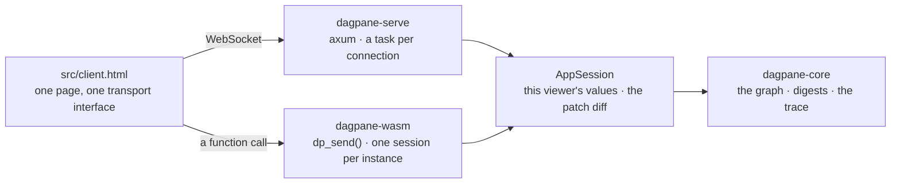
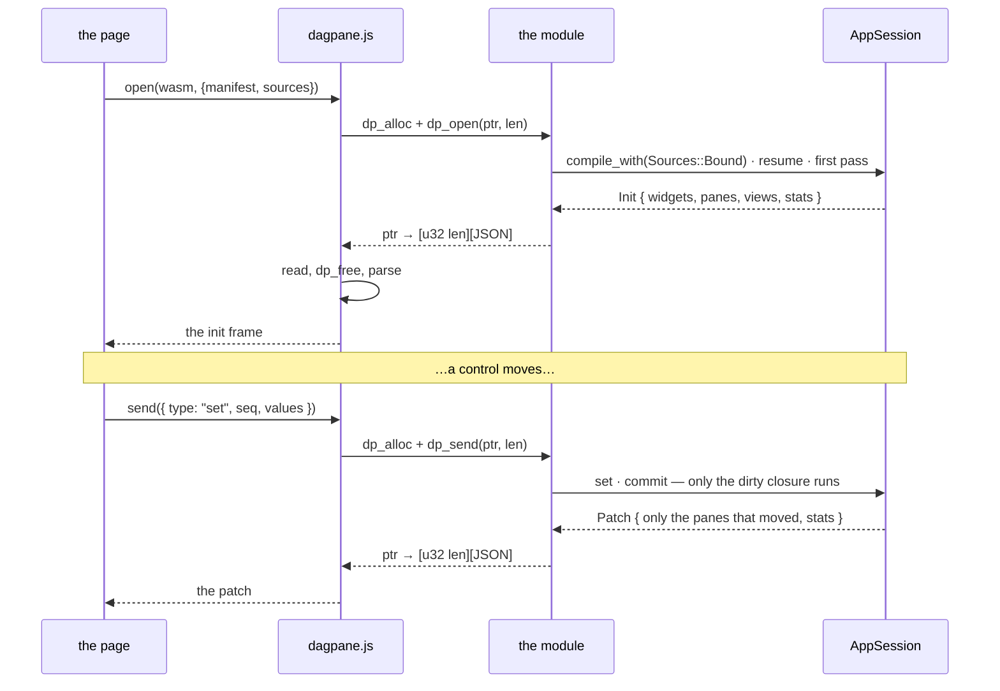

# dagpane-wasm

The engine in a browser, speaking the protocol it already speaks.

`dagpane-serve` holds an `AppSession`, takes a `ClientMessage` off a socket, and answers with
a `ServerMessage`. This crate holds an `AppSession`, takes a `ClientMessage` from a function
call, and answers with a `ServerMessage`.

## Architecture



Both arrows out of the client carry the **same two messages** and get the same four back. The
sameness is the point. **The client does not change** — its transport becomes a choice,
and everything above the transport is byte-identical. An app moved from a server into a
browser is the same app, not a port of one, and `crates/wasm/tests/run.sh` asserts that by
driving an exported bundle and checking it recomputes the same number of cells the CI `claim`
job asserts on the server.

## Event flow



## Quickstart

```sh
rustup target add wasm32-unknown-unknown
cargo build -p dagpane-wasm --target wasm32-unknown-unknown --release
```

That is the whole build. **No wasm-bindgen**, no `wasm-pack`, no npm, no post-processing step
— see `Cargo.toml` for the trade, which is about forty lines of `extern "C"` in `abi.rs` and
about the same again of JavaScript in `dagpane.js` against a proc-macro dependency tree and a
CLI whose version has to match it.

| | raw | gzipped |
|---|---:|---:|
| `dagpane-wasm` — engine, nine verbs, expression language, manifest compiler, CSV reader | **1.10 MiB** | **318 KiB** |
| DataFusion 54.1 | 27 MiB | 5.9 MiB |
| DuckDB-Wasm `1.33.1-dev57.0` | 34.25 MB | — |

`BENCHMARKS.md` has the other rows and how they were measured. The payload argument
`ROADMAP.md` §4 calls false for a query engine is true for a thin evaluator, and this is the
measurement rather than the assertion.

## Use it

```js
import { open } from "./dagpane.js";

const app = await open("./dagpane.wasm", {
  manifest: await (await fetch("app.toml")).text(),
  sources: { sales: await (await fetch("sales.csv")).text() },
});

app.init;                        // the `init` frame: widgets, panes, first views, stats
app.send({ type: "set", seq: 1, values: { floor: { kind: "float", v: 20 } } });
```

Or skip all of that:

```sh
dagpane export app.toml --out dist
cd dist && python3 -m http.server      # …or any static host
```

which writes `index.html`, `dagpane.js`, `dagpane.wasm` and any renderer scripts, with the
manifest and the rows inlined into the page.

**`export` needs a module to copy, and finding one is the caller's job.** With no `--wasm` it
looks in `target/wasm32-unknown-unknown/release/`, *relative to the current directory* — which
resolves to something only in a dagpane workspace that has just run the build above. An
installed `dagpane`, a shell below the workspace root and a `CARGO_TARGET_DIR` pointing
elsewhere all pass `--wasm path/to/dagpane_wasm.wasm`, and the failure says which of those it
was rather than leaving a relative path on screen. Embedding the module in the binary instead
would cost every `dagpane` a megabyte for a command most runs never call, and would put the
build of this crate inside the build of the CLI that builds it.

**It has to be served over `http://`.** A browser gives every `file://` document its own
opaque origin, so the module import and the WebAssembly fetch are both cross-origin from
there and both are refused — verified in Chromium, which is also where the working `http://`
case was verified. The page detects `file:` and says so rather than failing silently. A
folder is not a document you can double-click; any static server will do.

## The ABI, completely

Five exports, no imports. Every call that returns anything returns **one pointer** to a
little-endian `u32` length followed by that many bytes of UTF-8 JSON.

```text
dp_alloc(len)         -> ptr   a buffer for the host to write a request into
dp_free(ptr, len)              give any buffer back, whoever allocated it
dp_open(ptr, len)     -> ptr   compile the app; the reply is its `init` frame
dp_send(ptr, len)     -> ptr   one ClientMessage in, one ServerMessage out
dp_deliver(ptr, len)  -> ptr   a ServerMessage from the OTHER half in, this half's patch out
```

`dp_deliver` is for a split app only, and it exists in Rust rather than in the glue because
applying a pass's boundary values **together** is the single obligation the transport carries
(ADR-0008). A page that unpacked a frontier itself could deliver half of one, and no test here
would see it. Without `side: "client"` in the config the module runs the whole app and
`dp_deliver` has nothing to do — which is exactly the case an exported bundle is in, having no
server to be the other half.

No imports at all, which is a consequence rather than a goal: `dagpane-core` is clockless,
I/O-free and deterministic because that is what makes it testable, and a module with nothing
to ask the host for is what that rule buys in a browser. No `getrandom` backend to configure,
no `wasi` shim, no COOP/COEP headers.

One session per module instance. A page showing two apps instantiates the module twice, which
isolates their memory; running many sessions over one compiled app is what `dagpane-serve` is
for, and a handle table here would be a second multi-tenancy implementation with no tenant in
it.

## Where this is and is not honest

**This crate moves the whole graph.** `ROADMAP.md` §4's defensible version is "the placement
of each cell is a deployment decision rather than a rewrite", and that is a different thing,
now built alongside: a monotone cut, a frontier, and two halves that each run the unmodified
engine — `dagpane_core::placement` and ADR-0008. **Nothing serves a split yet**, this crate
included: `dagpane export` writes a bundle that evaluates every cell in the page, whatever a
manifest's `place` lines say. `dagpane check` says so on every placed app.

**The browser does not win because wasm is fast.** `benches/roundtrip/` measures it: wasm runs
the same pass **2.2–2.8× slower** than the native server does. It wins because a network is
slower still, and the number that decides it is the break-even — a threshold on **wire
overhead**, not on the round trip, because a browser wins when `wasm pass < wire + server
pass`. That is **0.08–0.49 ms of wire** on the bundled apps; on the round trip the same
threshold is the wasm pass itself, 0.13–0.89 ms. Loopback is about that, which is why a local
comparison is a coin flip.

Those numbers are the bundled apps on one machine, and a break-even is a property of the app's
own pass — a heavier pipeline needs more wire before the trade pays. `benches/roundtrip/` is
how to get the figure for yours rather than borrowing these.

**An exported app has no server, so it has none of a server's jobs.** No front door, no
scheduled refresh, no HTTP or SQL sources, no eviction. `dagpane export` refuses a source it
cannot inline rather than producing a bundle that breaks once opened.

## Testing

```sh
cargo test -p dagpane-wasm     # engine.rs, on the host — no browser, no wasm32 toolchain
./crates/wasm/tests/run.sh     # the real artefact, in a real WebAssembly engine
```

The split matters. Everything with logic in it is in `engine.rs` and is ordinary safe Rust;
the wasm-only part is the pointer marshalling, which has the least logic and the most that can
go quietly wrong. `run.sh` is what covers it — `cargo check` proving a thing compiles for
wasm32 is not evidence that it runs, a lesson `benches/wasm-engines/README.md` already records
from the other direction.

### That `package.json` is not an npm package

It is two lines — `private` and `type: "module"` — and it exists because **Node and a browser
decide what an ES module is by different means.** A browser goes by the `Content-Type` a server
sent; Node goes by the file extension and the nearest `package.json`. So `dagpane.js`, which is
an ES module and is served as one, is read by Node as CommonJS unless something says otherwise,
and `import { open } from "./dagpane.js"` fails with a syntax error.

Node 22.7 and later guess correctly by sniffing for `export`, which is why this was invisible
until it was run on anything older — GitHub's runners default to Node 20. Naming the file
`.mjs` would fix Node and break the browser case this crate exists for: nginx did not map
`.mjs` to `text/javascript` until 1.21, and a module served as `application/octet-stream` is
refused, which is a bad way to discover that "put it behind any static host" was optimistic.

Nothing installs it, nothing fetches from it, and no dependency is listed in it. The binary,
the wasm module and the exported bundle are all unchanged by its existence.
